# SliceFS DedupIndex — Unified Architecture

**Status:** FIRST DRAFT (coordinator) — input to synthesize/verify pair.
**Date:** 2026-04-23.
**Supersedes for the on-disk implementation:** `SYNTHESIS.md` §5–§6 plus the four specialist docs in `architecture/`. Each design choice in this document carries inline citations of the form `[01-api-and-types §N]`, `[02-storage-and-layout §N]`, `[03-durability-and-recovery §N]`, `[04-performance-and-operations §N]`, `[SYNTHESIS §N]`, or `[COORDINATOR-LOG §N]`.

---

## 1. Status & scope

This document specifies the bullet-proof technical architecture for SliceFS's persistent on-disk `DedupIndex` — the subsystem that answers *"have I durably stored this 28-byte ChunkHash?"*. The design substrate is **redb 4.1** (single-file COW B+tree) fronted by **fastbloom** with **CAS-as-truth recovery**, picked in `[SYNTHESIS §5]`.

> **Dependency note.** The current workspace `Cargo.toml` pins `redb = "3.1"`; this architecture targets **redb 4.1**. A redb 3.1 → 4.1 upgrade is a phase-0 prerequisite to MVP; see §15.0 for the gating task and API delta.

The architecture covers:
- Module/crate layout and public Rust API (`DedupIndex` trait + `RedbDedupIndex` type).
- On-disk storage layout at `<store>/cas/.dedup-index/`.
- Durability and crash-recovery semantics (formal invariants + sequence diagrams).
- Concurrency model (single-writer batcher + lock-free readers).
- Performance SLOs and observability.
- Configuration knobs and operational modes.
- Testing strategy and phasing.

Out of scope: distributed/multi-host replication, block compression, FUSE-layer wiring inside `slicefs-cli` (deferred to `05-fuse-integration.md`), GC policy beyond the `remove()` contract.

**Type-naming reconciliation.** The four specialist docs vary: `01-api-and-types.md §Naming note` introduces `RedbDedupIndex`; `02/03/04` retain the placeholder `PersistentDedupIndex`. Per `[COORDINATOR-LOG §5]` the binding production name is **`RedbDedupIndex`**. Where this document cross-references `[02 §...]`, `[03 §...]`, or `[04 §...]` you may see `PersistentDedupIndex`; treat the names as identical until a coordinated rename pass lands.

---

## 2. Goals & non-goals

### Goals (G)

- **G1.** Single-host scale to **10⁹ entries**, multi-year lifetime.
- **G2.** Cold `lookup` p99 ≤ **500 µs**; warm `lookup` p99 ≤ **10 µs**; insert p99 ≤ **5 ms** (default mode). `[04 §1]`.
- **G3.** Bounded RAM: total ≤ **1.5 GB at N=1 B**, with bloom dominating (1.2 GB). `[04 §5]`.
- **G4.** **Never** produce a false positive on `lookup` — `IDX ⊆ CAS` at all times, including across crashes. `[03 I1]`.
- **G5.** Recovery RTO ≤ **30 s for ≤ 50 M entries** (offline mount-time rebuild from CAS). `[04 §1]`.
- **G6.** Run on consumer NVMe (1 DWPD endurance budget) at "medium steady" throughput (~100 M inserts/day). `[SYNTHESIS §N4]`.
- **G7.** Pure-Rust authoritative store; no FFI, no C dependencies. `[01 §1.1]`.
- **G8.** Cross-platform (macOS via FUSE-T, Linux via libfuse) with platform-correct durability primitives. `[03 §9]`.

### Non-goals (NG)

- **NG1.** Multi-host or distributed dedup (separate v2.x project).
- **NG2.** Online rebuild for N > 50 M in MVP (deferred to v2). `[03 §6]`.
- **NG3.** Online bloom resize / capacity growth (manual `slicefs reindex --bloom-capacity 2x`). `[SYNTHESIS §6.5]`.
- **NG4.** Cross-store dedup index sharing. `[02 §9]`.
- **NG5.** Cryptographic integrity beyond CRC32C / xxh3 file headers. `[SYNTHESIS §8]`.
- **NG6.** Online resize, MVCC reader snapshots, or value payloads — **SET semantics only.** `[SYNTHESIS §2 F6]`.

---

## 3. Invariants

Twelve invariants govern the design — hard (red, load-bearing) and soft (green, defenses-in-depth).

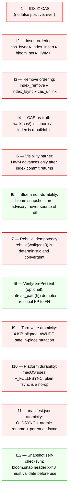

`[03 §1]` is binding. I1, I2, I7, I10 are load-bearing; rest are corollaries. **A false positive in `lookup` is catastrophic data loss.**

---

## 4. Architecture overview

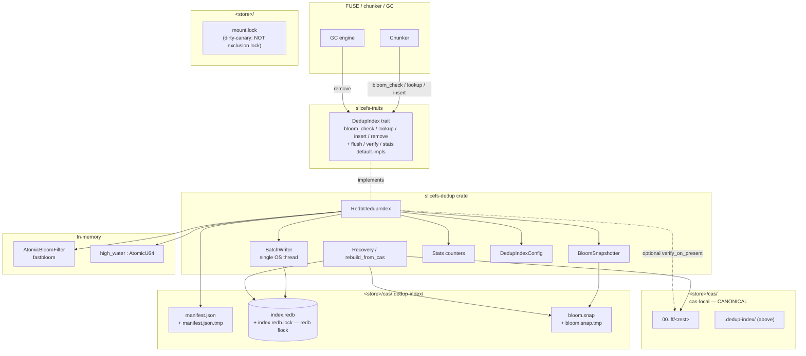

**Key boundaries:**
- The trait is the contract. Two impls: `MemDedupIndex` (test/dev) and `RedbDedupIndex` (production). `[01 §1.1]`, `[01 §3]`.
- Writes flow Caller → MPSC → BatchWriter → redb commit → bloom + HWM. `[04 §2]`, `[01 §7.2]`.
- Reads flow Caller → bloom (lock-free) → optional redb read txn → optional CAS `stat(2)`. `[03 §3]`, `[04 §3]`.
- The CAS directory (`<store>/cas/`) is canonical; the index is a derivable cache hosted at `<store>/cas/.dedup-index/`. `[03 I4]`, `[02 §1]`.

---

## 5. Public API

### 5.1 Trait surface (`slicefs-traits`)

The existing trait `[slicefs-traits/src/dedup_index.rs]` is preserved verbatim and extended with three default-impl methods so `MemDedupIndex` compiles unchanged. `[01 §4]`, `[COORDINATOR-LOG D2]`.

```rust
pub trait DedupIndex: Send + Sync {
    /// Fast probabilistic existence check. False ⇒ definitely absent.
    fn bloom_check(&self, hash: &ChunkHash) -> bool;

    /// Authoritative lookup. Returns Present | Absent (never DefinitelyAbsent).
    fn lookup(&self, hash: &ChunkHash) -> Result<DedupResult, CasError>;

    /// Idempotent insert. Caller MUST have already fsync'd the CAS block (I2).
    fn insert(&self, hash: &ChunkHash) -> Result<(), CasError>;

    /// GC-only remove. Bloom is NOT updated.
    fn remove(&self, hash: &ChunkHash) -> Result<(), CasError>;

    // ---- additions, default-impl no-ops for MemDedupIndex ----

    /// Force pending writes / bloom snapshot to durable storage.
    fn flush(&self) -> Result<(), CasError> { Ok(()) }

    /// On-disk integrity scan (page-CRC walk). Used by scrubber.
    fn verify(&self) -> Result<VerifyReport, CasError> {
        Ok(VerifyReport::default())
    }

    /// Stats snapshot — coarse trait-level shape; richer `StatsSnapshot`
    /// available on `RedbDedupIndex` directly.
    fn stats(&self) -> IndexStats { IndexStats::default() }
}
```

`DedupResult` is unchanged from `[slicefs-traits/src/dedup_index.rs]`: `DefinitelyAbsent | Present | Absent`.

### 5.2 `RedbDedupIndex` (production type, `slicefs-dedup`)

Constructors: `create(config)`, `open(config)`, `rebuild_from_cas(config)` (atomic via `*.tmp + rename + fsync(parent)`; idempotent per I7). Methods beyond the trait: `flush() -> Result<(), DedupIndexError>`, `stats_snapshot() -> StatsSnapshot`, `verify() -> Result<VerifyReport, DedupIndexError>`. `Drop` is best-effort: shuts down `BatchWriter` with a 5 s timeout, flushes, updates `manifest.last_shutdown_was_clean=true`. Full signatures and the `Drop` impl: `[01 §5]`.

### 5.3 Errors

Internal-rich `DedupIndexError` enum (one variant per redb sub-error: `Redb`, `Storage`, `Transaction`, `Commit`, `Table`; plus `BloomCorrupt`, `ManifestCorrupt`, `BloomCapacityExceeded`, `Recovery`, `Io`, `EnginePanic`) — wraps to narrow `CasError::Index/Io` at the trait boundary. Full enum: `[01 §2.3]`. Trait methods wrap engine panics via `std::panic::catch_unwind` and surface them as `CasError::Index("engine-panic: …")` — **no panic escapes the trait boundary.** `[01 §8]`.

---

## 6. Internal structure

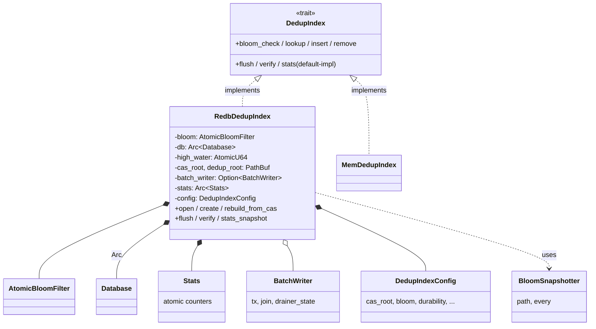

Full field-level diagram: `[01 §3]`. **Crate placement:** new crate `crates/slicefs-dedup/` per `[01 §1.1]` and `[COORDINATOR-LOG D1]`. `cas-local` remains the test/dev crate; `MemDedupIndex` stays put for trait parity tests.

---

## 7. Storage layout

### 7.1 Directory tree

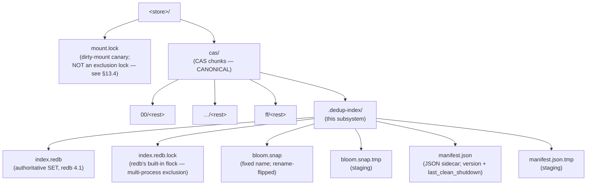

`[02 §1]`. The DedupIndex lives **inside** the CAS root: backups that copy `cas/` get the index for free; `rm -rf cas/.dedup-index/` is the canonical "rebuild from scratch" operator action. `mount.lock` is a **dirty-mount canary**, NOT an exclusion lock — see §13.4 for the full locking model.

### 7.2 redb schema

```rust
pub const DEDUP_TABLE: TableDefinition<'static, &[u8; 28], ()>
    = TableDefinition::new("dedup_index_v1");
```

Single table named `dedup_index_v1`, fixed-width 28-byte key, unit value. ~140 hashes per 4 KiB redb leaf after per-entry length tag and B+tree overhead at N=10⁹ `[02 §2.2]`. Schema version is the table-name suffix (`_v1`); migrations cut new tables and drop the old `[02 §2.3]`.

If a future redb release removes `Value for ()`, fall back to `Table<&[u8;28], u8>` with constant `1` (cost: +1 byte per leaf entry). `[02 §2.2]`.

### 7.3 `manifest.json` schema

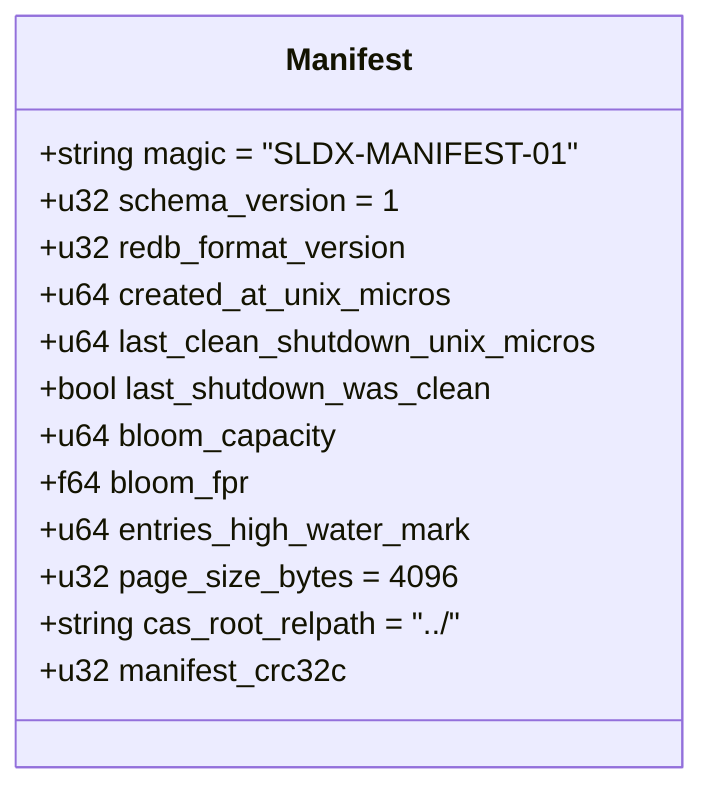

Source: `[02 §4]`. The earlier draft proposed `header.json`; the rewritten `02-storage-and-layout` overrides to `manifest.json` (canonical). It is **not** authoritative (redb's superblock is) but lets recovery decide quickly. JSON, not binary: <1 KiB, rewritten only at clean shutdown and bloom-capacity change. Atomicity: `tmp + rename + fsync(parent)`; durability: `O_DSYNC` per I11. `last_shutdown_was_clean=false` on next mount → Suspect transition (§9.1). `manifest_crc32c` covers JSON-canonicalized bytes minus the CRC field.

### 7.4 `bloom.snap` byte format

Source: `[02 §3.2]`. **64-byte fixed header + variable payload + 16-byte fixed footer.** All integers little-endian.

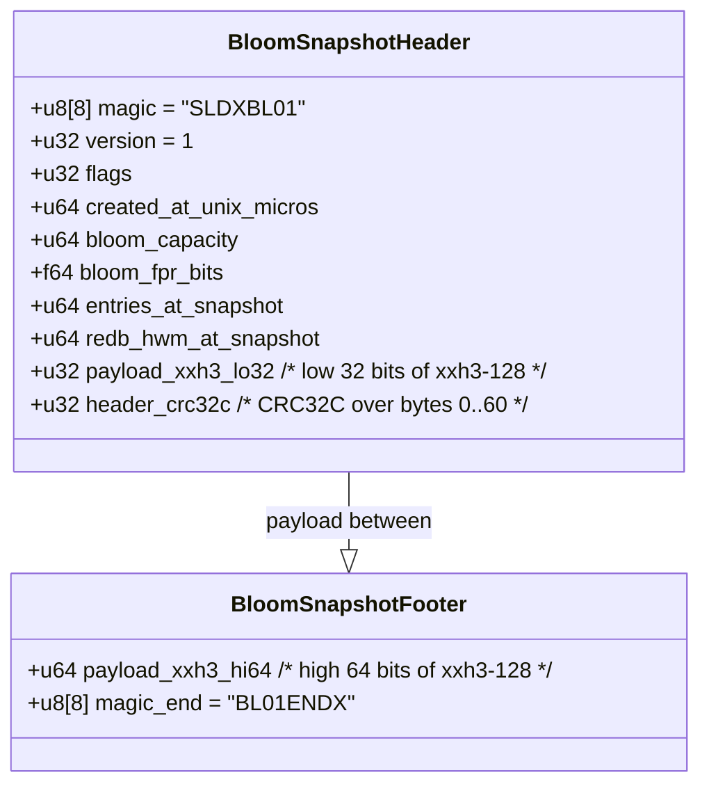

The integrity scheme is **belt-and-braces**:

- **Header** is self-checksummed by **CRC32C** over its first 60 bytes (catches header torn writes; cheap to recompute on every read).
- **Payload** is self-checksummed by **xxh3-128**, split as 32 low bits in the header (offset 56–60) and 64 high bits in the footer. xxh3-128 catches sub-page torn writes anywhere in the 1.2 GB payload at ~4–6 GB/s, with cryptographic-grade collision resistance — required because a 1.2 GB rename is **not atomic at the device level beyond AWUPF (4 KiB)** `[02 §3.2]`.
- The `redb_hwm_at_snapshot` field cross-checks bloom-vs-index drift on load (a snapshot whose HWM is ahead of redb's last-committed HWM is rejected and the bloom is rebuilt from redb).
- The file is written via `bloom.snap.tmp + rename + fsync(parent dir)`; on macOS the parent fd is additionally `F_FULLFSYNC`'d. Torn-file states are bounded by the rename-atomic boundary; torn-payload states are bounded by xxh3-128.

**xxh3-128 is mandatory** at 1.2 GB scale; CRC32C collision probability (~2⁻³²) is acceptable on a 1 KB sidecar but not on a 1.2 GB payload. The earlier draft downgraded payload integrity to CRC32C; this revision restores `[02 §3.2]`.

### 7.5 Page size

**4 KiB** redb page size (default). Fits NVMe AWUPF; ~143 hashes per leaf; tree depth 5 at N=10⁹. `[02 §6]`. Configurable via `DedupIndexConfig::page_size` for non-default deployments.

### 7.6 Growth model

| N        | On-disk (~40 B/entry) | Bloom (RAM, 9.6 b/e @ 1% FPR) |
|---------:|----------------------:|------------------------------:|
| 10⁶      | ~40 MB                | ~1.2 MB                       |
| 10⁷      | ~400 MB               | ~12 MB                        |
| 10⁸      | ~4 GB                 | ~120 MB                       |
| 10⁹      | ~40 GB                | ~1.2 GB                       |
| 10¹⁰     | ~400 GB (deferred)    | ~12 GB (deferred)             |

`[02 §7]`, `[04 §4]`. N=10¹⁰ is excluded from MVP — RAM ceiling violation, deferred to v2.x segment-blooms.

---

## 8. Insert / Lookup / Remove sequences

### 8.1 Insert (canonical) — default mode

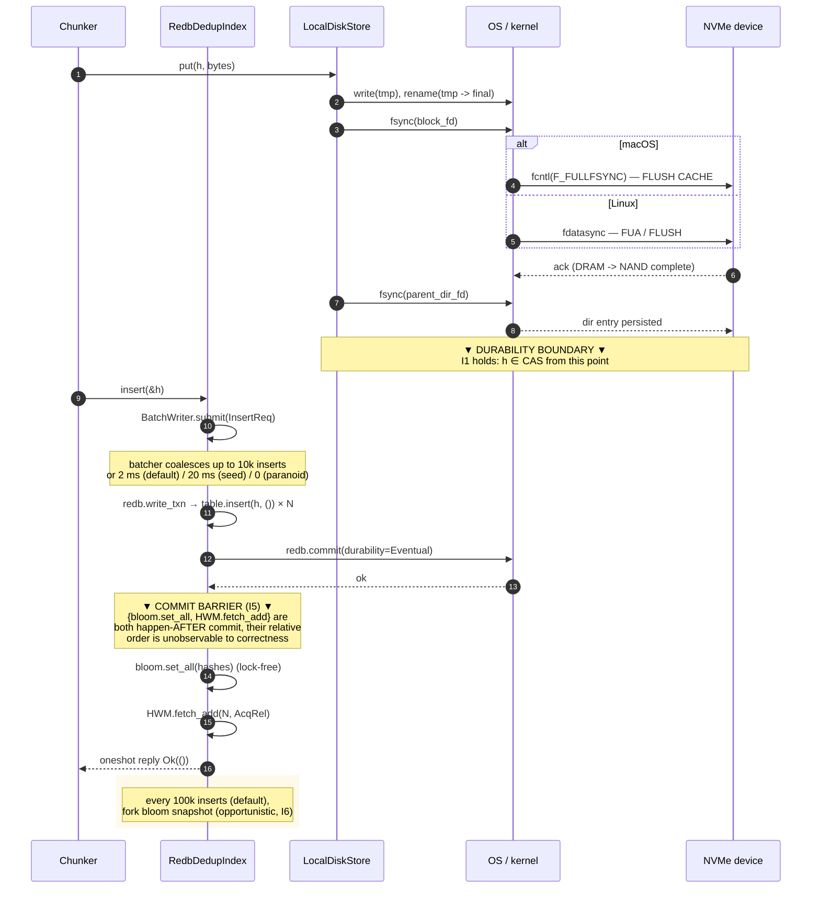

`[03 §2]` + `[04 §2]` merged. **Strict ordering rule:** `redb.commit ▸ {bloom.set_all, HWM.fetch_add} ▸ caller-reply`. The braces are intentional: both ops happen-after commit; their relative order is unconstrained, and either transient state (`bloom_check=hit ∧ HWM=old` or `bloom_check=miss ∧ HWM=new`) is within the I1/I5 contract.

> **Caller observability note (S1 / OQ-11).** A successful `insert` reply does **NOT** promise post-crash visibility. With `Durability::Eventual`, the commit returns when the txn is staged in the OS page cache, not when the device flushed; a `kill -9` within the ~200 ms group-commit window can lose the entry on next mount. After a crash, a follow-up `lookup(h)` may return `Absent` — benign per I4. **Callers MUST NOT cache "I inserted h" as authoritative across a crash boundary without first calling `flush()`** (forces F_FULLFSYNC and waits for ack). See test #13 in §14.2.

### 8.2 Lookup

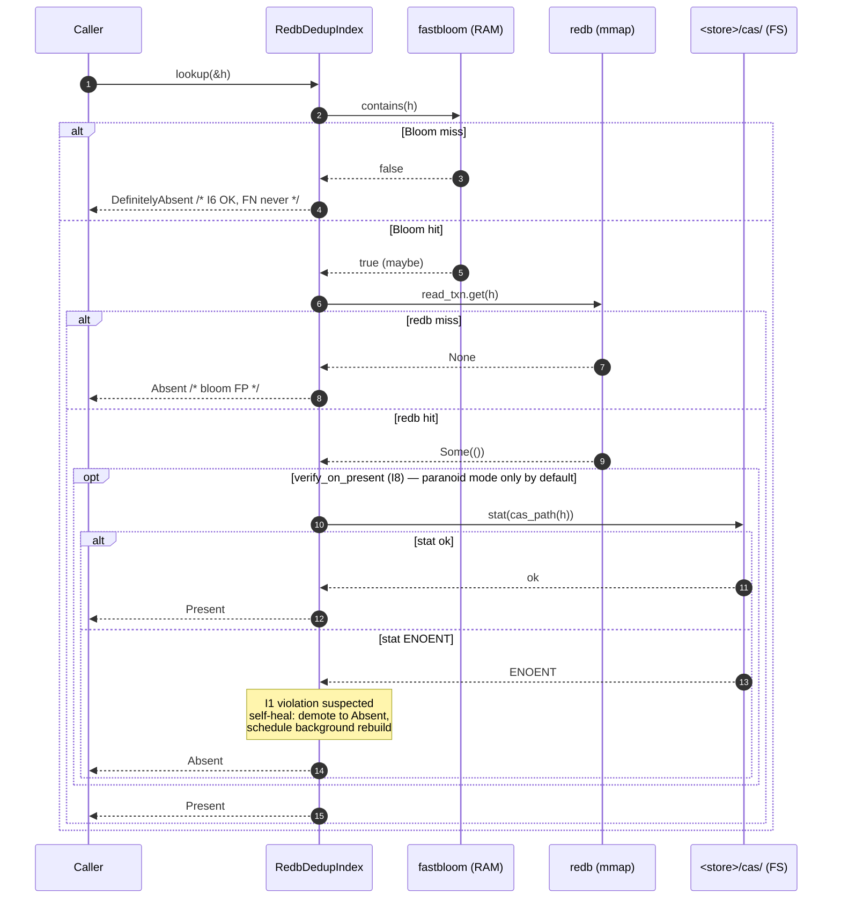

`[03 §3]`.

### 8.3 Remove

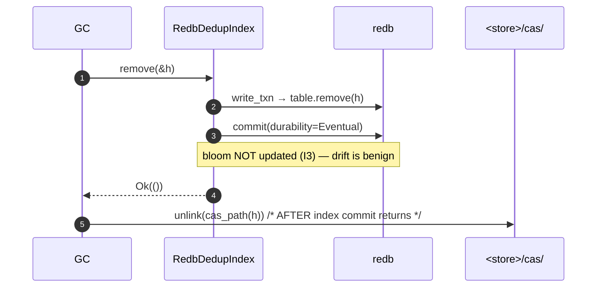

`[03 §2 I3]`, `[02 §8.2]`. Drift past `effective_fpr > 4 × design_fpr` **OR** `drift_ratio = removed_since_rebuild / capacity > 0.20` triggers a background bloom rebuild from live redb (~60 s at N=1 B). `[04 §7]`. Both thresholds are surfaced in `BloomConfig` (§13).

### 8.4 Insert / remove race for the same hash (G2 from COORDINATOR-LOG)

If the chunker calls `insert(h)` while GC is concurrently calling `remove(h)`, redb's single-writer mutex serializes the redb txns but the CAS-write and CAS-unlink can interleave: unlink lands *after* the remove's redb commit and *before* the insert's `cas.put` finishes → redb says `Present(h)` while CAS lacks `h` (I1 violation).

> **G2 contract** (lifted from `[COORDINATOR-LOG §3 G2]`, tracked as OQ-15): the GC layer holds an exclusive per-hash lock spanning (refcount-check, redb-remove, cas-unlink). Within one batcher window, `insert(h)` + `remove(h)` for the same `h` are coalesced in submission order; the chunker's `cas.put(h)` with `verify_on_present=true` re-`stat`s `cas_path(h)` after `put` to detect concurrent unlink and re-`put` if needed.

This is an open dependency on the GC subsystem. **MVP ships with GC disabled** and `verify_on_present=true` in any test that exercises `remove`.

---

## 9. Recovery & startup

### 9.1 State machine

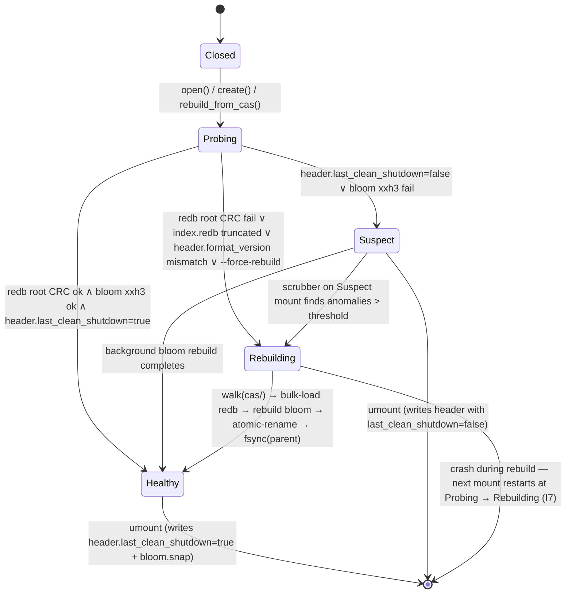

`[03 §5]`.

### 9.2 Rebuild procedure (`rebuild_from_cas`)

Source-of-truth definition (per `crates/cas-local/src/disk_block_store.rs`):
- Root: `<store>/cas/`.
- Layer 1: 256 shard directories `00`..`ff`.
- Layer 2: leaf files named `<rest_of_hex>` whose full hash is `<XX> ++ <rest>`.

Steps (idempotent per I7) `[03 §6]`:

1. `mkdir -p <store>/cas/.dedup-index/`. `fsync(<store>/cas/)`.
2. Open `index.redb.tmp` (fresh redb file) and `bloom.snap.tmp`.
3. Stream-walk `<store>/cas/`: for each shard `XX` ∈ `[00..ff]`, `getdents64`; validate `XX ++ rest` parses as 28-byte ChunkHash (56 hex chars); skip `*.tmp` files (in-flight CAS writes); emit `h` to a bounded MPSC channel.
4. Drainer thread: accumulate up to 100 000 keys; sort; open redb write_txn; `table.insert(h, ())` for each; commit with `Durability::Immediate`.
5. In parallel, push each `h` into the new fastbloom (lock-free `AtomicBloomFilter`).
6. After last shard, write the bloom snapshot:
   - Write `bloom.snap.tmp` (header CRC32C + payload + xxh3-128 footer) with `O_DSYNC`.
   - `rename(bloom.snap.tmp → bloom.snap)`.
   - `fsync(<store>/cas/.dedup-index/)` — parent-dir fsync after rename, in that order, so the dirent is durable before the next step.
7. Atomic-rename `index.redb.tmp → index.redb`. `fsync(<store>/cas/.dedup-index/)`.
8. Rewrite `manifest.json` with `last_shutdown_was_clean=true`, current `bloom_capacity`, new HWM, via `manifest.json.tmp + O_DSYNC + rename + fsync(parent)`.

### 9.3 Rebuild cost (single-thread walker, cold cache)

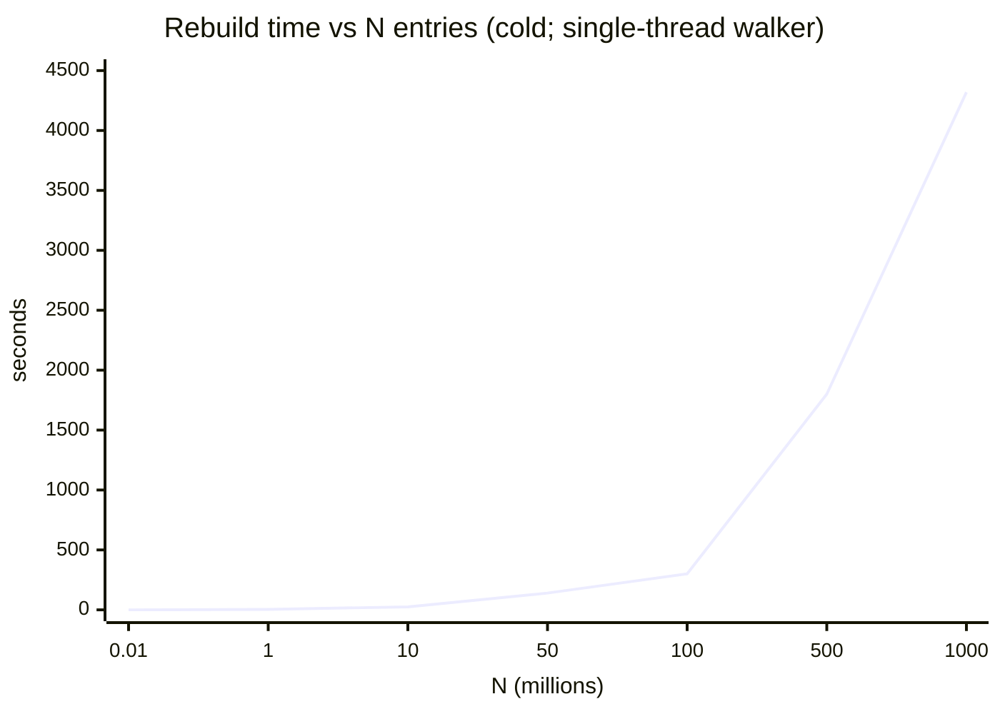

`[03 §6]`. N ≤ 50 M: blocks the mount (acceptable per `[SYNTHESIS §N5]`). N > 50 M: deferred to v2 (online rebuild with Suspect-mode partial reads). `[COORDINATOR-LOG OQ-8]`.

---

## 10. Concurrency model

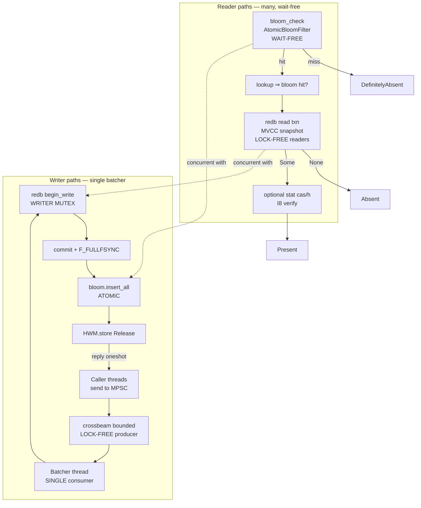

`[04 §3]`. **Lock map:** only mutex is redb's internal write-txn lock, batcher-only. Readers use MVCC snapshots (no writer contention). Bloom + HWM atomic; producers contend on the bounded MPSC tail (lock-free crossbeam). `[01 §7.3]`.

**Batcher details `[04 §2]`:** queue `crossbeam_channel::bounded(16384)` MPSC; reply via per-request `crossbeam_channel::bounded(1)` (sync — MVP `slicefs-dedup` does not pull tokio; OQ-14a closed); batch sizes 10 000 default / 100 000 seed; coalesce 2 ms default / 20 ms seed / 0 paranoid; backpressure via bounded-channel block, `try_send` fast path returns `CasError::Backpressure` plus `dedup_index.transient_errors_total` counter + `tracing::warn!` per OQ-3.

---

## 11. Performance contract (SLO table)

| SLO | Target | Source |
|---|---|---|
| Cold lookup p50 | ≤ 80 µs | `[04 §1]` |
| Cold lookup p99 | ≤ 500 µs | `[04 §1]` / `[SYNTHESIS §N3]` |
| Warm lookup p50 | ≤ 5 µs | `[04 §1]` |
| Warm lookup p99 | ≤ 10 µs | `[04 §1]` / `[SYNTHESIS §N3]` |
| Insert throughput, steady-state | ≥ 20 K ins/s | `[04 §1]` |
| Commit latency p99 (default) | ≤ 5 ms | `[04 §1]` |
| Commit latency p99 (paranoid) | ≤ 12 ms | `[04 §1]` (per-insert F_FULLFSYNC; floor 1–4 ms per `[03 §7]`) |
| Recovery RTO (≤ 50 M chunks) | ≤ 30 s | `[04 §1]` / `[SYNTHESIS §N5]` |
| Recovery RTO (1 B chunks, cold cache) | ≤ 1.2 h offline (~4320 s) | `[03 §6]` table |
| Recovery RTO (1 B chunks, warm cache) | ≤ 12 min (~720 s) | `[03 §6]` table |
| Recovery RTO (1 B chunks, target with v2 sharded walker) | ≤ 30 min online | `[03 §6]` v2 lever |
| Insert throughput, seed mode (gate) | ≥ 100 K ins/s on reference NVMe; failure → §15.0.1 escalation | `[04 §1]` / `[SYNTHESIS §7 Q4]` |
| Total RAM at N=1 B | ≤ 1.5 GB (bloom 1.2 GB + redb 256 MB cap + batcher 16 MB + misc 28 MB) | `[04 §5]` |
| Steady-state RSS rule | `bloom + 300 MB` (recovery transient exempt) | `[04 §5]` |

SLO violations trigger v2 escalation per `[SYNTHESIS §8]` (log-structured for endurance; sharded redb for write throughput).

---

## 12. Observability

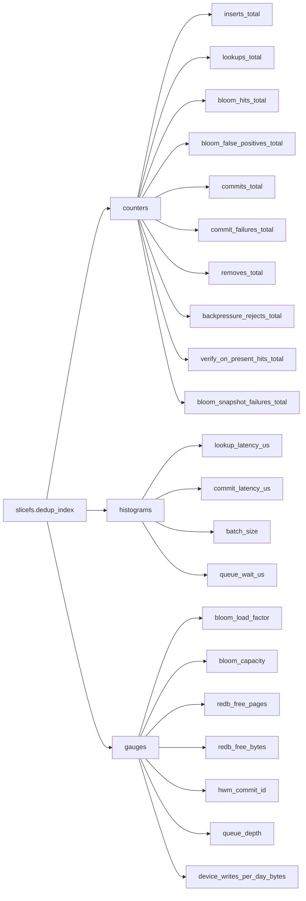

`[04 §6]`, `[01 §2.4]`. Stack: `tracing` + `metrics` crate (`prometheus` cargo feature optional); `slicefs stats --json` canonical CLI export `[04 §9]`; OTEL non-goal in MVP. `device_writes_per_day_bytes` (G7) is the v2-escalation gate (>5% DWPD/day → log-structured `[SYNTHESIS §5 pt 5]`).

---

## 13. Configuration knobs (consolidated `DedupIndexConfig`)

`DedupIndexConfig` (full Rust signature in `[01 §2.2]` + `[03 §7, §8]` + `[04 §2, §4, §8]`) holds: `cas_root`, `dedup_root` (= `<store>/cas/.dedup-index/`), a `BloomConfig`, a `DurabilityMode`, batcher knobs (`batcher_coalesce_window`, `redb_group_commit_window`, `batch_size_{default,seed}`, `mpsc_capacity=16384`), durability flags (`verify_on_present`, `use_f_fullfsync`), redb knobs (`redb_cache_bytes=256 MiB`, `page_size=4 KiB`), and scrubber/compactor cadences. Builder pattern via `DedupIndexConfig::builder(cas_root)` matches workspace idiom.

```rust
/// Three durability tiers per `[01 §2.2]` + `[03 §7]` `mount_mode`.
#[derive(Debug, Clone, Copy, PartialEq, Eq)]
pub enum DurabilityMode {
    Seed,      // Durability::None — bulk seed only; reload from CAS on crash
    Default,   // Durability::Eventual + 200 ms group-commit — daily driver
    Paranoid,  // Durability::Immediate per-insert (one F_FULLFSYNC each)
}

#[derive(Debug, Clone, Copy)]
pub struct BloomConfig {
    pub capacity: usize,
    pub fpr: f64,
    pub snapshot_every: usize,                  // 100k default; 10k paranoid
    pub snapshot_interval: Duration,            // 600s default; 60s paranoid
    pub stale_ratio: f64,                       // 0.90 — refuse to open above
    pub drift_rebuild_ratio: f64,               // 0.20 — drift-trigger; `[04 §7]`
    pub effective_fpr_rebuild_multiplier: f64,  // 4.0 — FPR-trigger; `[04 §7]`
}
```

Both bloom-rebuild thresholds are evaluated with OR semantics. The `effective_fpr_rebuild_multiplier` is hardcoded per-mode in MVP (configurable in v2; §15.2).

### 13.1 Mode preset summary

The three modes match `mount_mode` in `[03 §7]` (`fast` was a draft-only rename of `seed`; this revision restores the spec name).

| Knob | Seed | Default | Paranoid |
|------|------|---------|----------|
| `durability` | `Durability::None` | `Durability::Eventual` + 200 ms group-commit | `Durability::Immediate` per-insert |
| `batcher_coalesce_window` | 20 ms | 2 ms | 0 |
| `batch_size` | 100 000 | 10 000 | 1 |
| `verify_on_present` | false | false | **true** |
| `bloom.snapshot_every` | clean shutdown only | 100 000 | 10 000 |
| `bloom.drift_rebuild_ratio` | 0.20 | 0.20 | 0.10 |
| `bloom.effective_fpr_rebuild_multiplier` | 4.0 | 4.0 | 2.0 |
| `scrubber_period` | off | 24 h, 0.1% sample | hourly index CRC + on-mount full sample rehash |
| `use_f_fullfsync` | true (I10) | true | true |
| Insert latency floor | ~50 µs | ~100 µs | ~1–4 ms |
| Commit p99 | n/a (no fsync) | ≤ 5 ms | ≤ 12 ms |

**Seed-mode SLO arithmetic.** `Durability::None` skips fsync entirely; throughput is CPU/page-cache bound. A crash loses every insert since the last `flush()`. The §11/§15.0.1 gate of ≥ 100 K ins/s is met when `batch_size 100 000 × ≥ 1 batch/s` — easy on consumer NVMe absent F_FULLFSYNC, achievable on Apple Silicon with caveats per OQ-12. The earlier draft renamed `Seed → Fast` and silently switched its durability from `None` to `Eventual`; this revision restores the spec.

### 13.4 Locking model (correction to draft)

The previous draft folded multi-process exclusion into `<store>/mount.lock`. That is wrong: `mount.lock` is a **dirty-mount canary** (a regular file; existence-on-next-mount triggers `MountLockError::DirtyMount`; removed via `Drop`). It is **not** an `flock(2)`-based exclusion lock — two racing SliceFS processes will both find the file absent and proceed. Source: `crates/metadata/src/mount_lock.rs:41`.

| Resource | Mechanism |
|---|---|
| `index.redb` | `index.redb.lock` — redb's built-in `flock(LOCK_EX)` advisory lock |
| `bloom.snap`, `manifest.json` | none — caller's responsibility (FUSE layer single-mounts; `slicefs reindex --offline` requires unmounted) |
| Dirty-shutdown detection | `<store>/mount.lock` (RAII via `MountLock`) |

**S3 / kill-9 leftover lock.** If a previous process died without releasing `index.redb.lock`, redb 4.1's `Database::open` reclaims it automatically — the OS releases the `flock` on fd-close (including process exit). The dirty-canary `<store>/mount.lock` *will* persist (not removed on process exit) and correctly triggers WAL replay on next mount.

For hardened multi-process safety beyond the redb-file scope (i.e. concurrent races on `bloom.snap`/`manifest.json`), a phase-0 task to add an `flock(LOCK_EX | LOCK_NB)` on the store directory is filed as `[OQ-15]` / `[OQ-16]`. Not required for MVP under the FUSE single-mount contract.

---

## 14. Testing strategy

Two layers: **property-test parity** (G5) and **failure-injection** (`[03 §10]`).

### 14.1 Property-test parity (proposed by coordinator)

For any randomized sequence of `bloom_check`/`lookup`/`insert`/`remove`, `RedbDedupIndex` and `MemDedupIndex` must agree on `lookup` modulo the `Absent`/`DefinitelyAbsent` distinction. **Permitted demotion:** on-disk impl may answer `Absent` where `MemDedupIndex` says `DefinitelyAbsent` (snapshot rebuild repopulates bloom — more bits set, more FPs). **Forbidden promotion:** `Absent` → `DefinitelyAbsent` for the same hash without an intervening `remove` (would require unsetting bloom bits — invalid).

Seed: `crates/cas-local/src/mem_dedup_index.rs::prop_all_inserted_hashes_are_found`. New proptests in `slicefs-dedup`: `prop_open_close_open_preserves_set` (insert N, drop, reopen, all `Present`); `prop_rebuild_idempotent` (two rebuilds → byte-identical redb root + bloom — validates I7); `prop_no_FP_under_random_ops` (Present ⇒ in model HashSet — validates I1); `prop_durability_mode_roundtrip` (insert-flush in each mode; reopen; all findable).

### 14.2 Failure-injection (`[03 §10]`)

14 scenarios; tests 1, 2, 6, 9, 10, 11, 13 mandatory before MVP ship; tests 3–5, 7–8, 12, 14 mandatory before `paranoid` GA.

| # | Scenario | Mechanism | Validates |
|---|----------|-----------|-----------|
| 1 | `kill -9` mid-insert, after CAS fsync, before redb commit | child harness; SIGKILL between calls | I2, I4 |
| 2 | `kill -9` during redb commit (torn root) | SIGKILL inside redb's COW root swap | I9, I7 |
| 3 | Truncate `index.redb` by 4 KiB at tail | offline byte surgery | I9, I7 |
| 4 | Flip a single byte in `bloom.snap` payload (4 KiB block at offset 600 MB) | offline corruption mid-payload | I12, I6 (xxh3-128 catches → rebuild from redb) |
| 5 | Delete `manifest.json` | rm between mounts | I11 |
| 6 | Delete a CAS block file but keep its index entry | rm `<store>/cas/XX/rest` | I8, I1 |
| 7 | Crash between bloom snapshot rename and parent dir fsync | inject failure after rename(2) | I6, I11 |
| 8 | Inject ENOSPC on redb commit | LD_PRELOAD / fault injection | I2, I5 |
| 9 | Power-fail simulation (loop device, drop writes after T_drop) | nbd-server | I9, I10 |
| 10 | 100× concurrent `kill -9` with random insert timing | stress harness | I1 (headline) |
| 11 | macOS-only: `F_FULLFSYNC` no-op shim, then power-fail | DYLD_INSERT_LIBRARIES | I10 (regression canary) |
| 12 | Rebuild idempotency: trigger rebuild, kill mid-rebuild, mount again | SIGKILL during walk | I7 |
| 13 | **S1 — Caller cached `Ok` 1 ns before crash.** Caller calls `insert(h)`, awaits `Ok` from batcher, immediately `kill -9` before group-commit window expires. On next mount, `lookup(h)` may return `Absent`. **Test: assert no FP, validate caller cannot assume Ok ⇒ Present after mount unless preceded by `flush()`.** | child harness; SIGKILL within ≤ 1 ms of Ok-reply, before any later `flush()` | OQ-11, I1, caller-redrive contract `[01 §5.1 doc-note]` |
| 14 | **Linux fsync-lying virtualization** (e.g. qemu without `cache=none`). Equivalent of test #11 but for Linux: replace `fdatasync` with no-op via `LD_PRELOAD`, then power-fail. | LD_PRELOAD shim | I10 (Linux regression canary) — symmetric to #11 |

### 14.3 Benchmarks (`[04 §10]`)

| # | Bench | SLO validated |
|---|-------|---------------|
| 1 | `bench_seed_burst_100m` | seed throughput ≥ 100 K/s (gate) |
| 2 | `bench_lookup_warm` | warm p50/p99 |
| 3 | `bench_lookup_cold` | cold p50/p99 |
| 4 | `bench_steady_mixed` | steady insert ≥ 20 K/s |
| 5 | `bench_commit_latency` | commit p99 ≤ 5 ms (default) / 12 ms (paranoid) |
| 6 | `bench_recovery_50m` | RTO ≤ 30 s |
| 7 | `bench_gc_drift_rebuild` | drift-rebuild cost |

---

## 15. Phasing

### 15.0 Phase 0 — redb 3.1 → 4.1 upgrade (prerequisite to MVP)

The workspace currently declares `redb = "3.1"`; this architecture targets **redb 4.1** for `Database::compact()`, free-page metrics, refined `Durability` semantics, and the stable `Value for ()` impl in §7.2. Phase-0 task: bump `Cargo.toml`, audit `metadata` crate call sites (the only current consumer), and confirm `cargo test -p metadata` passes on 4.1 (1287-test green baseline). **Audit checklist** (confirm against redb 4.1 release notes): `Durability` variant spellings (does `Durability::None` and `Durability::Eventual` exist in 4.1?); `Database::stats()` field names (`free_pages`, `tree_height`); `Database::compact()` signature; `Builder::set_page_size`; `impl Value for ()`. Until phase 0 lands, **all §11 SLOs are advisory** (computed against a redb version not in the repo).

#### 15.0.1 Gate-failure escalation (`bench_seed_burst_100m` < 100 K ins/s)

If §14.3 bench #1 misses the gate on the reference NVMe, the response is **staged**, not an immediate v2-engine swap. Decision-maker: architecture coordinator.

| Step | Action |
|------|--------|
| 1 | **Reproduce** on a second NVMe model (rule out device anomaly). |
| 2 | **Sharded redb (4 DBs by hash prefix).** 4× BatchWriter overhead, parallel writer slots. Reference: `[04 §10]`. Rollback: revert to single-DB if lookup p99 regresses >5%. |
| 3 | **Re-run** `bench_seed_burst_100m`; pass criterion ≥ 100 K ins/s on sharded variant. |
| 4 | **Still failing:** escalate to **v2 log-structured engine** (`[SYNTHESIS §5 pt 5]`, `[04 §10]`). New crate `slicefs-dedup-log`; same trait surface; migration = offline rebuild from CAS. redb path remains feature-flagged for telemetry comparison. |

The earlier-draft sentences "escalate to v2" (§15.1) and "shard or escalate to log-structured early" (§15.2) collapsed into the table above. The rule is: **shard first, swap second.**

### 15.1 MVP (this document → first ship)

- **Phase-0 prerequisites:** §15.0 redb 3.1 → 4.1 upgrade with `metadata` tests green on 4.1; `05-fuse-integration.md` for the wiring task (not for the crate itself).
- New crate `slicefs-dedup` with `RedbDedupIndex` over redb 4.1; default `Durability::Eventual` + `verify_on_present=false`; modes `seed`/`default`/`paranoid` matching `[03 §7]` `mount_mode`.
- Layout `<store>/cas/.dedup-index/` with `index.redb` + `index.redb.lock` (redb's flock), `bloom.snap` + `bloom.snap.tmp`, `manifest.json` + `manifest.json.tmp`.
- Recovery: offline `walk(<store>/cas/)` for N ≤ 50 M (≤ 30 s RTO; §11). Bloom: static sizing; snapshot every 100 K inserts + clean shutdown; xxh3-128 payload + CRC32C header.
- `slicefs stats` extended with `[Index]` block; `slicefs reindex` and `slicefs dedup recover` (non-destructive per `[OQ-5]`).
- Trait extended with `flush()` / `verify()` / `stats()` (default-impl no-ops). **Migration of `MemDedupIndex` consumers:** source change none; tests calling `idx.flush()` on `MemDedupIndex` get a silent no-op (correct — no on-disk state); `cas-local::mem_dedup_index` re-export remains; no production binary uses it (`[COORDINATOR-LOG G3]`).
- **FUSE-layer wiring** behind `--features dedup-index` flag in `slicefs-cli` (full default-on is fast-follow once `05-fuse-integration.md` lands).
- All 14 failure-injection tests + property-test parity suite green (§14). Bench 1 (`bench_seed_burst_100m`) clears the §15.0.1 gate.

### 15.2 v2 (gated on telemetry / feedback)

- **Endurance metric exceeds threshold** (`device_writes_per_day_bytes` > 5% DWPD/day on the index alone, G7 in §12): swap redb for the segmented-log engine `[02-storage-and-layout §7]`; same trait, new `LogDedupIndex` module; migration = offline rebuild from CAS.
- **Bloom capacity ceiling:** segment-bloom incremental growth (`[SYNTHESIS §6.5]`); auto-reindex on shutdown above 90%.
- **Online rebuild** for N > 50 M (Suspect-mode partial reads from `walk(<store>/cas/)`; `[03 §6]` v2 lever).
- **Sharded redb** if not already landed in MVP under §15.0.1 gate response.
- **Background CAS scrubber** with sample-rehash, generalized from paranoid mode.
- OTEL export; `effective_fpr_rebuild_multiplier` configurable in builder API.

### 15.3 Out of scope

Distributed/multi-host replication; block compression (removed in v2.0 streaming); crypto integrity beyond CRC32C/xxh3; cuckoo or learned-index bloom replacement; cross-store sharing; `F_BARRIERFSYNC` (F_FULLFSYNC is correct, `[03 §9]`); runtime AWUPF probing (hardcode 4 KiB); OTEL telemetry.

---

## 16. Open questions (for human review)

Carried forward from `[COORDINATOR-LOG §4]`. Each has a proposed default the draft uses; final answers may shift before MVP lock.

| # | Question | Proposed default |
|---|---|---|
| OQ-1 | New crate `slicefs-dedup` vs `cas-local::dedup` module | New crate. |
| OQ-2 | `flush()` fallible vs infallible | Fallible. |
| OQ-3 | `RetryPolicy` knob | **No (fail fast)** + `dedup_index.transient_errors_total` counter + `tracing::warn!` on transient EBUSY (until FUSE retry middleware ships). |
| OQ-4 | `dedup.lock` separate from `mount.lock` | **Reversed.** `mount.lock` is a dirty-canary, not an exclusion lock; rely on redb's `index.redb.lock`. See §7.1, §13.4. |
| OQ-5 | Non-destructive `slicefs dedup recover` | Yes. |
| OQ-6 | Layout stability | Stable across minor; breakable across major via `manifest.schema_version` + `dedup_index_v1` suffix. |
| OQ-7 | Group-commit window on Apple Silicon | Bench; default 200 ms / 2 ms. |
| OQ-8 | Online rebuild for N > 50 M in MVP | No — offline only. |
| OQ-9 | `verify_on_present` default | `false` in MVP. |
| OQ-10 | Multi-year bloom growth | Manual `slicefs reindex --bloom-capacity 2x`. |
| OQ-11 | Caller-redrive contract | **Closed.** §8.1 doc-note + §14.2 test #13: callers must not cache Ok ⇒ Present across crash without `flush()`. |
| OQ-12 | F_FULLFSYNC cost on Apple Silicon | Bench on M2. |
| OQ-13 | redb single-writer ceiling | Run `bench_seed_burst_100m`; on failure, §15.0.1 staged escalation. |
| OQ-14 | Verify-on-present p99 cost | Same as OQ-9. |
| OQ-14a | Reply channel choice | **Closed.** `crossbeam_channel::bounded(1)` (sync). See §10. |
| OQ-15 | GC ↔ DedupIndex per-hash locking | **Open.** Defer to GC architect; §8.4 G2 contract. |
| OQ-16 | `slicefs reindex` while mounted | **Open.** MVP unmounted-only; v2 Suspect-mode. |

---

## 17. Glossary

- **AWUPF** — Atomic Write Unit Power Fail (NVMe-spec). SliceFS hardcodes ≥ 4 KiB. `[02 §6]`.
- **Bloom** — fastbloom `AtomicBloomFilter`. FP possible; **FN never**. `[01 §2.1]`.
- **CAS** — Content-Addressed Storage at `<store>/cas/`; canonical truth. `[03 I4]`.
- **ChunkHash** — 28-byte (224-bit) hash; BLAKE3 truncated.
- **COW** — Copy-on-write; redb's strategy. `[03 §6]`.
- **DDT** — ZFS Dedup Table antipattern (full RAM metadata). `[SYNTHESIS §1, 04-prior-art §1]`.
- **DurabilityMode** — `Seed` (`Durability::None`) / `Default` (`Eventual` + 200 ms) / `Paranoid` (`Immediate` per-insert). Aligned with `mount_mode` `[03 §7]`.
- **F_FULLFSYNC** — Darwin `fcntl(2)` issuing NVMe FLUSH CACHE; mandatory on macOS. `[03 §9]`.
- **FN / FP** — False Negative (benign — extra idempotent CAS write) / False Positive (**catastrophic** — chunker skips write). `[03 I1]`.
- **HWM** — High-Water Mark; monotonic insert counter, I5 visibility barrier.
- **I1–I12** — Invariants enumerated in §3.
- **MPSC** — `crossbeam_channel::bounded` multi-producer single-consumer queue.
- **redb** — Pure-Rust embedded COW B+tree KV store, version 4.1.
- **Suspect** — Mount state on bloom xxh3 fail or unclean shutdown; RW with background scrubber. `[03 §5]`.
- **WAF** — Write Amplification Factor.
- **xxh3** — xxhash-rust hash (xxh3-128 for `bloom.snap` payload; CRC32C for headers). `[02 §3.2]`.

---

*End of ARCHITECTURE.md first draft. Companion: `architecture/COORDINATOR-LOG.md`. Next: synthesize/verify pair iterates on this draft.*
