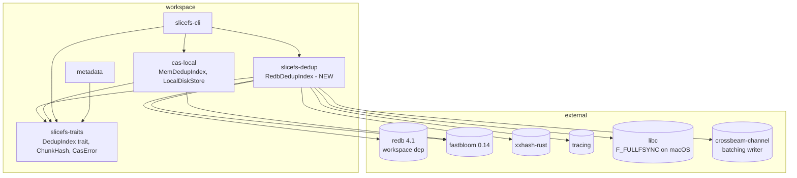
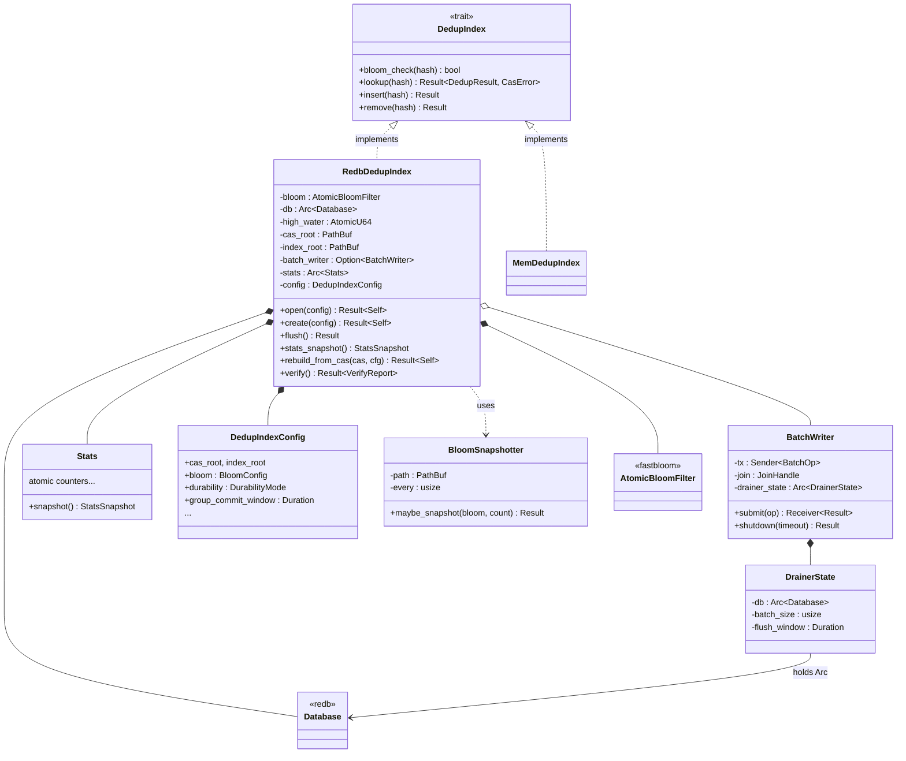
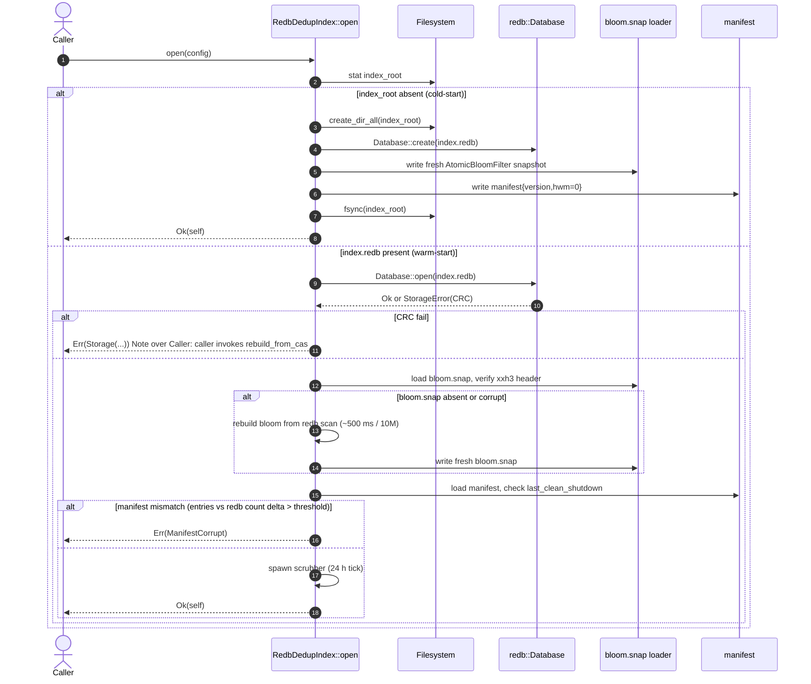
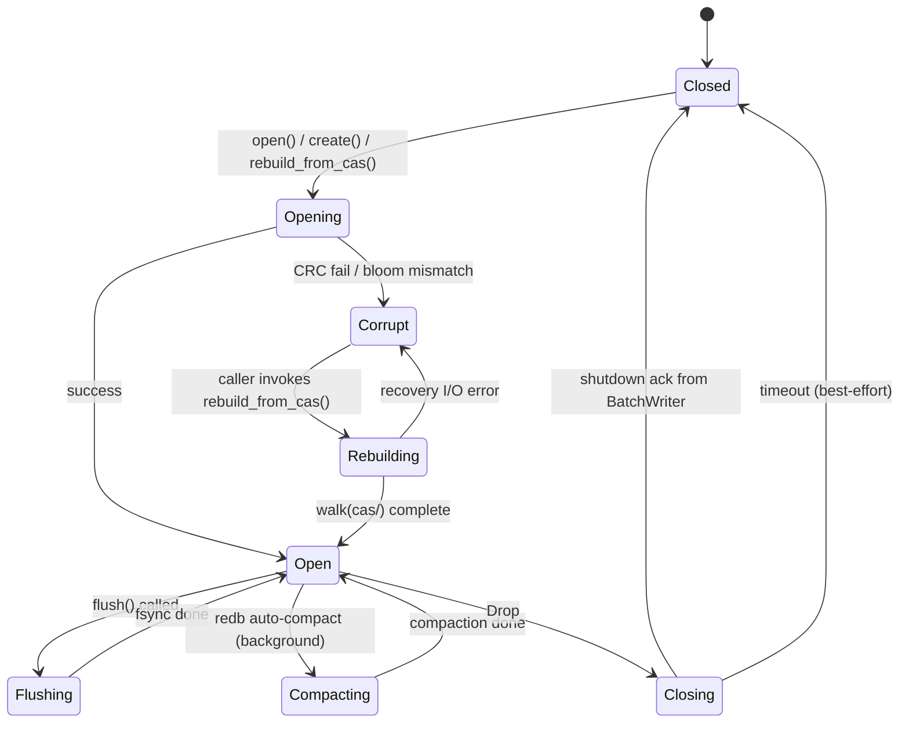

# DedupIndex Architecture — 01 · API & Types

This document fixes the **public surface** for the on-disk deduplication index that
SYNTHESIS.md picked: a redb-backed authoritative store fronted by a fastbloom filter,
with the CAS directory as the recovery source of truth. It nails down where the code
lives, the exact Rust signatures, the lifecycle, and the concurrency contract.
Subsequent architecture docs (02-storage-layout, 03-recovery, 04-bloom-persistence,
05-batching-writer, 06-telemetry) extend this surface; nothing here should change
without updating those.

> **Naming note.** SYNTHESIS §6.1 used the placeholder name `PersistentDedupIndex`. This
> document renames the production type to **`RedbDedupIndex`** to make the engine
> explicit at the call site (the trait is `DedupIndex`, the in-memory impl is
> `MemDedupIndex`, the on-disk impl is `RedbDedupIndex` — symmetry is worth a rename).
> If telemetry [SYNTHESIS §5 point 5] forces the v2 log-structured engine, we add
> `LogDedupIndex` next to `RedbDedupIndex` rather than mutating either name.

---

## 1. Module / crate layout

### 1.1 Decision: new crate `slicefs-dedup` (do **not** stuff it into `cas-local`)

SYNTHESIS §6.1 hedged ("don't bloat the workspace with a new crate before we know we
need separation"). I'm overruling that for three concrete reasons:

1. **`cas-local` is intentionally a stub/test crate.** Its `lib.rs` doc-comment opens
   with *"Stub/test implementations of the SliceFS CAS traits. … to prove out the trait
   interfaces and support unit and integration testing before the owner's production
   algorithm crates are integrated."* The on-disk dedup index is a **production**
   subsystem with its own crash-safety contract, recovery loop, and telemetry — it does
   not belong in a crate explicitly labelled as scaffolding.
2. **Dependency hygiene.** `cas-local` today pulls only `blake3`, `fastbloom`, and
   `thiserror`. Adding `redb`, `xxhash-rust`, `tracing`, `crossbeam-channel`, and
   `libc` (for `F_FULLFSYNC`) into a "stub" crate makes test compile times worse for
   every other consumer.
3. **AGPL surface clarity.** Commercial licensees may want to swap engines. A separate
   `slicefs-dedup` crate is the natural seam.



Crate-internal module layout for `slicefs-dedup`:

```
crates/slicefs-dedup/
├── Cargo.toml
├── src/
│   ├── lib.rs                ← re-exports: RedbDedupIndex, DedupIndexConfig, …
│   ├── redb_index.rs         ← RedbDedupIndex impl (DedupIndex trait)
│   ├── config.rs             ← DedupIndexConfig + Durability + builder
│   ├── error.rs              ← DedupIndexError + From<…> ↔ CasError glue
│   ├── stats.rs              ← Stats + StatsSnapshot (atomics + Display)
│   ├── bloom_persistence.rs  ← snapshot file format + xxh3 header
│   ├── batch_writer.rs       ← MPSC drainer thread (seed mode)
│   ├── recovery.rs           ← walk(cas/) → bulk-load (next doc owns details)
│   └── fsync.rs              ← cross-platform F_FULLFSYNC wrapper
└── tests/                    ← integration + crash-injection
```

`cas-local::mem_dedup_index` stays put — it's the test/dev impl per SYNTHESIS §8.

> **Open question O-1 (coordinator):** Does the workspace owner want `slicefs-dedup`
> as a new crate now, or should I implement it as a `pub mod dedup` inside an even
> newer `slicefs-core` umbrella crate planned for a later phase? I default to "new
> crate now" — splitting later is harder than merging.

---

## 2. Public types

All snippets target Rust 2024.

### 2.1 The struct — `RedbDedupIndex`

```rust
//! crates/slicefs-dedup/src/redb_index.rs

use std::path::{Path, PathBuf};
use std::sync::Arc;
use std::sync::atomic::AtomicU64;

use redb::{Database, TableDefinition};
use fastbloom::AtomicBloomFilter;
use slicefs_traits::dedup_index::DedupIndex;

use crate::batch_writer::BatchWriter;
use crate::config::DedupIndexConfig;
use crate::stats::Stats;

/// 28-byte ChunkHash key, unit value (SET semantics — SYNTHESIS §2 F6).
pub(crate) const HASHES: TableDefinition<'static, &[u8; 28], ()> =
    TableDefinition::new("hashes");

/// Authoritative on-disk DedupIndex backed by redb 4.1.
///
/// See SYNTHESIS.md §5 for the design rationale and §6 for the implementation
/// sketch this struct realizes.
pub struct RedbDedupIndex {
    /// In-memory front (SYNTHESIS §6 step 1, F1). Lock-free atomic ops.
    bloom: AtomicBloomFilter,

    /// COW B+tree (SYNTHESIS §5). Wrapped in Arc so the BatchWriter thread
    /// can hold a clone without lifetime-coupling to &self.
    db: Arc<Database>,

    /// Visibility barrier (Invariant I2). Monotonically increasing insert
    /// counter; readers compare to determine "did my insert land yet?".
    high_water: AtomicU64,

    /// CAS root, used by I5 verify-on-collision and by recovery.
    cas_root: PathBuf,

    /// On-disk root holding `index.redb`, `bloom.snap`, `manifest`.
    index_root: PathBuf,

    /// Optional batching writer (Some in `seed` mode, None otherwise).
    /// SYNTHESIS §6.6.
    batch_writer: Option<BatchWriter>,

    /// Cumulative metrics. Atomics — &self compatible.
    stats: Arc<Stats>,

    /// Frozen at open(); never mutated after.
    config: DedupIndexConfig,
}
```

### 2.2 Configuration — `DedupIndexConfig`

Builder pattern, matches the rest of the workspace's idiom (`BlockStoreConfig`).

```rust
//! crates/slicefs-dedup/src/config.rs

use std::path::PathBuf;
use std::time::Duration;

/// Three durability tiers from SYNTHESIS §6.3, with a strong-typed enum
/// rather than the raw redb::Durability so we can encode macOS-specific behavior.
#[derive(Debug, Clone, Copy, PartialEq, Eq)]
pub enum DurabilityMode {
    /// Per-insert F_FULLFSYNC on macOS / fdatasync on Linux. ~1–4 ms per insert.
    /// Use for compliance / unattended servers.
    Paranoid,
    /// Group-commit at `group_commit_window`. CAS-as-truth covers crash gap.
    /// Default for daily driver.
    Default,
    /// `Durability::None`. Bulk seed only — recovery rebuilds on crash.
    Seed,
}

/// Bloom-filter sizing (SYNTHESIS §6.5).
#[derive(Debug, Clone, Copy)]
pub struct BloomConfig {
    /// `fastbloom::with_false_pos(fpr).expected_items(capacity)`.
    pub capacity: usize,
    /// Target false positive rate, e.g. 0.01 = 1%.
    pub fpr: f64,
    /// Snapshot bloom to disk every N inserts. SYNTHESIS §6.5.
    pub snapshot_every: usize,
    /// Refuse to open if entries / capacity > this ratio (manual reindex required).
    pub stale_ratio: f64,
}

impl Default for BloomConfig {
    fn default() -> Self {
        Self {
            capacity: 1_000_000,
            fpr: 0.01,
            snapshot_every: 100_000,
            stale_ratio: 0.90,
        }
    }
}

/// Top-level config. Construct with `DedupIndexConfig::builder()`.
#[derive(Debug, Clone)]
pub struct DedupIndexConfig {
    pub cas_root: PathBuf,
    pub index_root: PathBuf,        // typically <cas_root>/.dedup-index
    pub bloom: BloomConfig,
    pub durability: DurabilityMode,
    pub group_commit_window: Duration,    // 200 ms default
    pub verify_on_present: bool,    // I5; default false in Default mode
    pub use_f_fullfsync: bool,      // macOS; default true
    pub batch_size_seed: usize,     // 100_000; only used in Seed mode
    pub redb_cache_bytes: usize,    // redb page cache; default 256 MiB
}

impl DedupIndexConfig {
    pub fn builder(cas_root: impl Into<PathBuf>) -> DedupIndexConfigBuilder { /* … */ }
}

pub struct DedupIndexConfigBuilder { /* fluent setters */ }
```

### 2.3 Errors — `DedupIndexError` (wraps and re-exports `CasError`)

The existing trait returns `Result<_, CasError>`. We **don't** widen the trait
signature; instead we wrap engine-specific failures into `CasError::Index(String)`
at the trait boundary, but we expose a richer `DedupIndexError` for crate-internal
callers (CLI, recovery, telemetry).

```rust
//! crates/slicefs-dedup/src/error.rs

use thiserror::Error;
use slicefs_traits::error::CasError;

#[derive(Debug, Error)]
pub enum DedupIndexError {
    #[error("redb: {0}")]
    Redb(#[from] redb::Error),

    #[error("redb storage: {0}")]
    Storage(#[from] redb::StorageError),

    #[error("redb transaction: {0}")]
    Transaction(#[from] redb::TransactionError),

    #[error("redb commit: {0}")]
    Commit(#[from] redb::CommitError),

    #[error("redb table: {0}")]
    Table(#[from] redb::TableError),

    #[error("bloom snapshot corrupt: {reason}")]
    BloomCorrupt { reason: String },

    #[error("manifest corrupt: {reason}")]
    ManifestCorrupt { reason: String },

    #[error("bloom capacity exceeded: {entries} / {capacity} (>{stale_pct:.1}%)")]
    BloomCapacityExceeded { entries: usize, capacity: usize, stale_pct: f64 },

    #[error("recovery failed: {0}")]
    Recovery(String),

    #[error("io: {0}")]
    Io(#[from] std::io::Error),

    #[error("panic recovered from redb: {0}")]
    EnginePanic(String),
}

impl From<DedupIndexError> for CasError {
    fn from(e: DedupIndexError) -> Self {
        match e {
            DedupIndexError::Io(io)            => CasError::Io(io),
            DedupIndexError::EnginePanic(msg)  => CasError::Index(format!("engine-panic: {msg}")),
            other                              => CasError::Index(other.to_string()),
        }
    }
}
```

### 2.4 Stats / observability — `StatsSnapshot`

```rust
//! crates/slicefs-dedup/src/stats.rs

use std::sync::atomic::{AtomicU64, Ordering};

/// Live counters; lock-free, &self-friendly.
#[derive(Debug, Default)]
pub(crate) struct Stats {
    pub bloom_hits:               AtomicU64,
    pub bloom_misses:             AtomicU64, // == DefinitelyAbsent count
    pub lookup_present:           AtomicU64,
    pub lookup_absent_fp:         AtomicU64, // bloom FPs caught at redb
    pub inserts_committed:        AtomicU64,
    pub inserts_in_flight:        AtomicU64, // batch_writer queue depth
    pub removes_committed:        AtomicU64,
    pub bytes_written_to_device:  AtomicU64, // for endurance gating §5 pt 5
    pub bloom_snapshots_written:  AtomicU64,
    pub recovery_runs:            AtomicU64,
    pub verify_on_present_hits:   AtomicU64, // I5 catches
}

/// Frozen snapshot, exposed via `RedbDedupIndex::stats_snapshot()`.
#[derive(Debug, Clone, serde::Serialize)]
pub struct StatsSnapshot {
    pub bloom_hits: u64,
    pub bloom_misses: u64,
    pub lookup_present: u64,
    pub lookup_absent_fp: u64,
    pub inserts_committed: u64,
    pub inserts_in_flight: u64,
    pub removes_committed: u64,
    pub bytes_written_to_device: u64,
    pub bloom_snapshots_written: u64,
    pub recovery_runs: u64,
    pub verify_on_present_hits: u64,
    /// Computed: `lookup_absent_fp / (bloom_hits + bloom_misses).max(1)`.
    pub effective_fpr: f64,
    /// `redb::Database::stats()` snapshot (page count, leaf bytes, etc).
    pub redb_stats: RedbStatsSnapshot,
}
```

`slicefs stats` (SYNTHESIS §8 MVP) renders this directly. `bytes_written_to_device`
is the gate on the "redb-now / log-v2" telemetry threshold from §5.

---

## 3. Internal type composition



`*--` = composition (owns), `o--` = aggregation (optional), `..>` = uses.

---

## 4. Trait extension proposal

The existing trait is minimal (4 methods). For the on-disk impl I propose **three
new methods**, with default impls so `MemDedupIndex` compiles unchanged.

```rust
//! crates/slicefs-traits/src/dedup_index.rs (proposed addition)

pub trait DedupIndex: Send + Sync {
    // … existing 4 methods unchanged …

    /// Force any pending writes / bloom snapshot to durable storage.
    ///
    /// Default impl is a no-op (correct for `MemDedupIndex`).
    /// `RedbDedupIndex` overrides to commit any in-flight batch and
    /// `F_FULLFSYNC` the index file.
    fn flush(&self) -> Result<(), CasError> { Ok(()) }

    /// Verify on-disk integrity of the index.
    ///
    /// - For `MemDedupIndex`: trivially returns Ok.
    /// - For `RedbDedupIndex`: page-CRC scan (see SYNTHESIS §6.4 step 7).
    ///
    /// Returns a count of inspected entries and any anomalies — used by
    /// the periodic scrubber (SYNTHESIS §8 v2 "Background CAS scrubber").
    fn verify(&self) -> Result<VerifyReport, CasError> {
        Ok(VerifyReport::default())
    }

    /// Statistics snapshot. Optional; default returns an empty report.
    /// See `StatsSnapshot` for the rich type from `slicefs-dedup`.
    fn stats(&self) -> IndexStats { IndexStats::default() }
}

#[derive(Debug, Default, Clone)]
pub struct VerifyReport {
    pub entries_scanned: u64,
    pub anomalies: Vec<String>,
}

#[derive(Debug, Default, Clone)]
pub struct IndexStats {
    pub entries: u64,
    pub bloom_capacity: u64,
    pub bloom_fpr_target: f64,
}
```

**Backward compatibility:** `MemDedupIndex` gets the default impls for free. No
signature changes. The richer `StatsSnapshot` lives in `slicefs-dedup` and is reached
via downcasting / a dedicated method on `RedbDedupIndex` only — the trait stays clean.

I deliberately **do NOT** add `rebuild_from_cas` to the trait — that's an associated
function on `RedbDedupIndex` (`pub fn rebuild_from_cas(cas_root, config) -> Result<Self>`).
Putting it on the trait would force every impl to grow a CAS-walking dependency.

> **Open question O-2 (coordinator):** Should `flush()` be **fallible-by-default**
> (current proposal) or **infallible-default** (`fn flush(&self) {}`)? Fallible is
> more honest but every existing call site that wants to ignore must `.ok()`. I
> picked fallible for safety; willing to flip if the team prefers terseness.

---

## 5. Constructor / lifecycle

```rust
impl RedbDedupIndex {
    /// Create a brand-new index. Errors if `index_root` already contains a non-empty
    /// `index.redb`. Use `open` to attach to an existing one or `rebuild_from_cas`
    /// to discard and re-derive from CAS.
    pub fn create(config: DedupIndexConfig) -> Result<Self, DedupIndexError> { /* … */ }

    /// Open an existing index. On corruption (page CRC fail, bloom xxh3 fail,
    /// manifest mismatch), returns Err — caller chooses to `rebuild_from_cas`.
    pub fn open(config: DedupIndexConfig) -> Result<Self, DedupIndexError> { /* … */ }

    /// Discard any existing index and rebuild from `cas_root`. SYNTHESIS §6.4 step 6.
    /// Atomic: writes to `index.redb.new` + `bloom.snap.new`, fsyncs, renames.
    pub fn rebuild_from_cas(config: DedupIndexConfig) -> Result<Self, DedupIndexError> { /* … */ }

    pub fn flush(&self) -> Result<(), DedupIndexError> { /* … */ }
    pub fn stats_snapshot(&self) -> StatsSnapshot { /* … */ }
    pub fn verify(&self) -> Result<VerifyReport, DedupIndexError> { /* … */ }
}

impl Drop for RedbDedupIndex {
    fn drop(&mut self) {
        // Best-effort: log on failure, never panic.
        let _ = self.batch_writer.take().map(|w| w.shutdown(Duration::from_secs(5)));
        let _ = self.flush();   // updates manifest's last_clean_shutdown
    }
}
```

### 5.1 Sequence: `open` (cold-start, warm-start, corrupted)



The "Err → caller calls `rebuild_from_cas`" pattern keeps recovery explicit at the
call site; we don't silently rewrite anything.

---

## 6. State machine



`Compacting` is a redb-internal background activity; we observe it via stats but
don't gate user calls on it. `Corrupt` is a terminal-until-rebuild state — user-facing
calls return `Err(StorageCorrupt)` instead of going to redb.

---

## 7. Concurrency model

### 7.1 The redb constraint vs our trait

redb is **single-writer MVCC**: many concurrent read txns; **one** write txn at a
time. Our trait uses `&self` everywhere — exactly right. `redb::Database` is itself
`Send + Sync`; an `Arc<Database>` shared between request threads needs no outer lock.

| Operation        | redb txn type | Outer lock needed? | Notes |
|------------------|---------------|--------------------|-------|
| `bloom_check`    | none          | no                 | Lock-free atomic bloom |
| `lookup`         | read          | no                 | Concurrent with writer |
| `insert` (Default) | write       | redb-internal mutex | Group-commit batch may serialize |
| `insert` (Seed)  | submit to BatchWriter | crossbeam MPSC | Drainer thread holds the write txn |
| `remove`         | write         | redb-internal mutex |  |
| `flush`          | write         | drains BatchWriter | |

### 7.2 Reader/writer interleaving — sequence

```mermaid
sequenceDiagram
    autonumber
    participant T1 as Thread A (reader)
    participant T2 as Thread B (reader)
    participant W  as Thread C (writer)
    participant DB as redb::Database
    participant BL as AtomicBloomFilter
    participant HW as high_water (AtomicU64)

    par concurrent reads
        T1->>BL: contains(h_a) -> true
        T1->>DB: begin_read()
        DB-->>T1: snapshot S0
        T1->>DB: table.get(h_a) -> Some(())
        T1->>T1: (verify_on_present? stat(cas/h_a))
        T1-->>T1: DedupResult::Present
    and
        T2->>BL: contains(h_b) -> false
        T2-->>T2: DedupResult::DefinitelyAbsent
    end

    Note over W,DB: writer arrives; readers continue against snapshot S0
    W->>DB: begin_write()
    DB-->>W: write txn (acquired single-writer slot)
    W->>DB: table.insert(h_c, ())
    W->>DB: commit() -- Durability per config
    W->>BL: insert(h_c)
    W->>HW: fetch_add(1)
    Note over T1,T2: subsequent read txns see S1 with h_c
```

Critical point (Invariant I2 enforcement): the bloom is mutated **after** the redb
commit returns. A reader that sees the bloom hit is therefore guaranteed to see the
redb entry — the asymmetry I1 cannot be violated by reordering.

### 7.3 Internal locking strategy

- **No outer `RwLock` around the database.** redb owns its own concurrency primitives.
- **No lock around the bloom.** `AtomicBloomFilter` is lock-free.
- **Single mutex** *only* inside `BatchWriter` for queue management; that's the
  crossbeam channel's internals — we don't add our own.
- **`high_water`** is `AtomicU64` with `Ordering::AcqRel` on writes / `Acquire` on
  reads.

This gives us: zero lock contention on reads, single redb writer slot for writes,
and an opt-in batching path for seed bursts (SYNTHESIS §6.6, §7 Q4).

---

## 8. Error-handling philosophy

**Tiers of failure**, with a clear policy for each:

| Tier | Examples | Policy | Returned-as |
|------|----------|--------|-------------|
| Caller bug | hash wrong size, capacity = 0 | `debug_assert!` + return `CasError::Index(...)` | `Err` |
| Recoverable I/O | redb file moved, disk full | propagate | `Err(CasError::Io)` |
| Corruption | CRC fail, bloom xxh3 fail, manifest mismatch | propagate, log error, **do not auto-rebuild** | `Err(CasError::Index)` — caller invokes `rebuild_from_cas` |
| Engine panic | redb internal `panic!` | catch via `std::panic::catch_unwind` at trait boundary | `Err(CasError::Index("engine-panic: …"))` |
| Bloom snapshot write fail | disk full mid-snapshot | log warning, **continue** — bloom rebuilds from redb on next open | (no `Err` to caller; bumps `Stats.bloom_snapshot_failures`) |
| Verify-on-present mismatch (I5) | bloom hit + redb hit + CAS file missing | treat as `Absent`, increment `verify_on_present_hits` | `Ok(DedupResult::Absent)` |
| Drop-time flush fail | crash mid-shutdown | log error; no panic | (silent; recovery on next open) |

**No panics escape the trait boundary.** All redb callsites are wrapped in
`catch_unwind` (trait-method outermost). Tests will inject panics to prove this.

**Logging discipline.** All non-fatal failures emit `tracing::warn!` with structured
fields (`hash`, `op`, `kind`); the bare `println!` / `eprintln!` is forbidden in this
crate.

> **Open question O-3 (coordinator):** Do we want a `RetryPolicy` config knob for
> transient redb errors (e.g. EBUSY on the lock file)? My default is "no, fail fast,
> let the FUSE layer's retry middleware deal with it" — but this couples us to a FUSE
> layer that doesn't have such middleware yet. Flagged for the FUSE-integration doc.

---

## 9. Summary of decisions and where they bind downstream docs

| Decision | Binds |
|----------|-------|
| New crate `slicefs-dedup`, type `RedbDedupIndex` | 02-storage-layout, 06-telemetry |
| `&self` everywhere, `Arc<Database>` shared, no outer RwLock | 05-batching-writer |
| `DurabilityMode::{Paranoid, Default, Seed}` enum | 03-recovery, fsync.rs |
| `flush` / `verify` / `stats` added to trait with no-op defaults | trait crate, MemDedupIndex |
| `rebuild_from_cas` is an associated fn, NOT on the trait | 03-recovery |
| Errors: rich `DedupIndexError` internal, narrow `CasError::Index(String)` at the trait edge | error.rs, all callers |
| Bloom snapshot failures are non-fatal, logged | 04-bloom-persistence |
| All panics caught at trait boundary | every `impl DedupIndex` method |

---

*End of 01-api-and-types.md. Next doc: `02-storage-layout.md` — owns the redb table
schema, `manifest` JSON, `bloom.snap` byte format, and the on-disk directory layout
(SYNTHESIS §6.7 in detail).*
