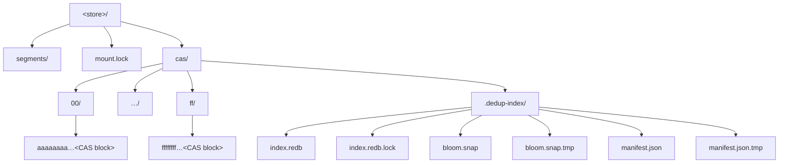
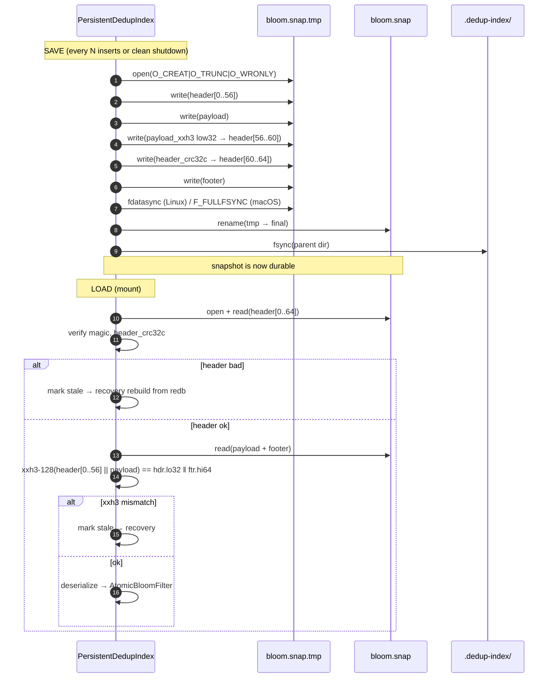
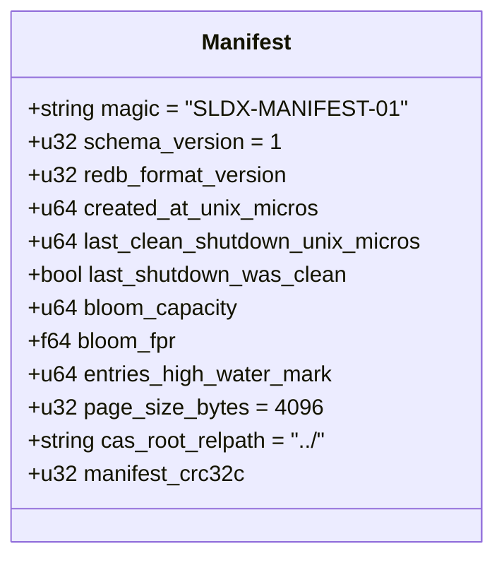
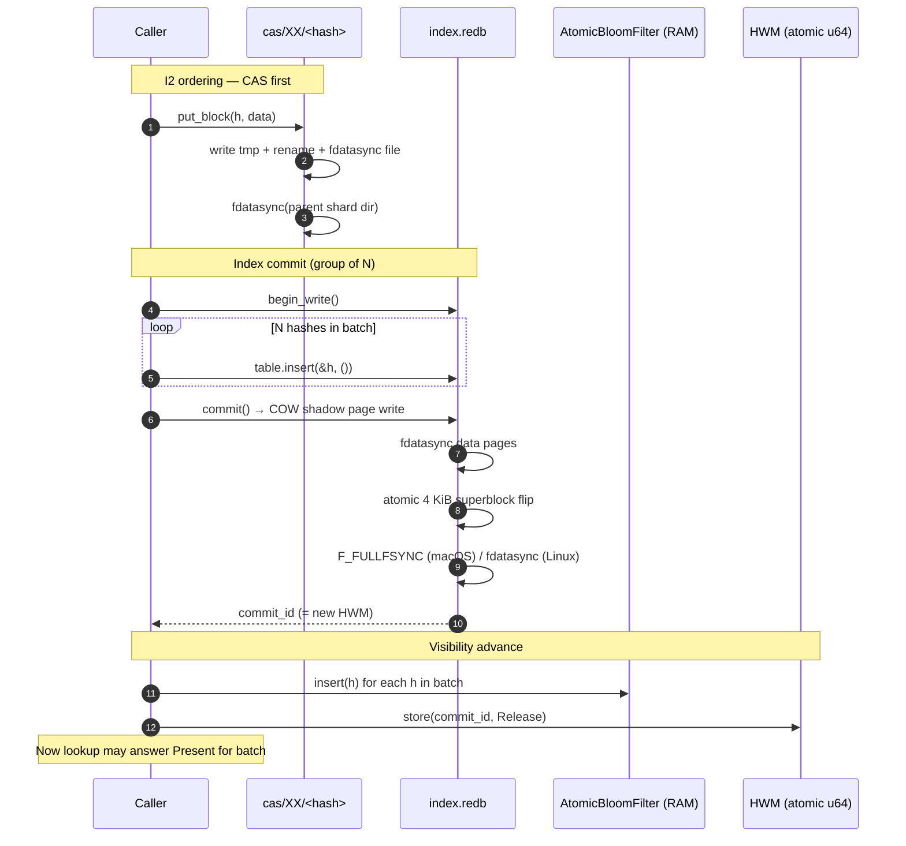
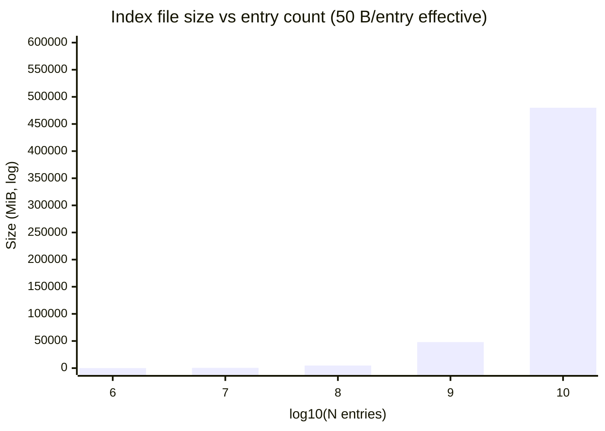
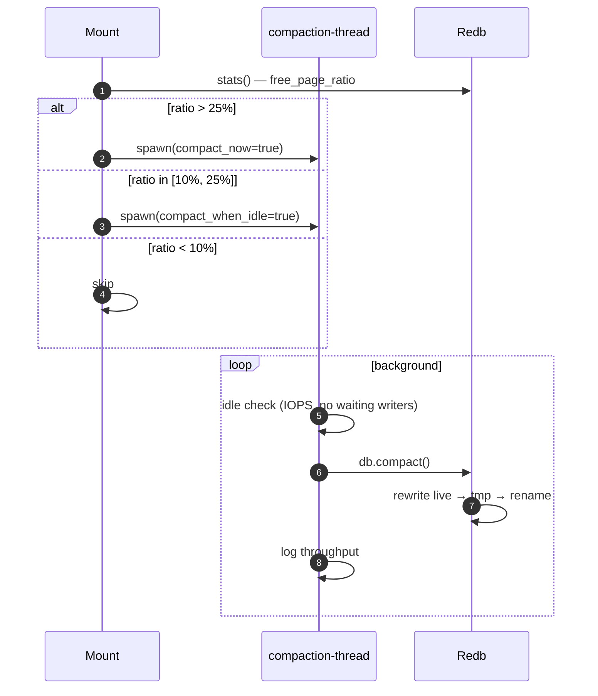

# DedupIndex — Storage & On-Disk Layout

**Status:** ARCHITECTURE — derived from [SYNTHESIS](../SYNTHESIS.md). **Date:** 2026-04-23.
**Scope:** physical bytes on disk for the persistent `DedupIndex` (redb 4.1 + bloom snapshot + manifest), and the directory layout shared with the CAS BlockStore.

This document is the byte-level companion to the trait-level architecture. It picks: where files live, what tables redb owns, the wire format of the bloom snapshot, header and footer bytes, atomicity boundaries, page size, growth math, compaction policy, and the multi-volume question.

---

## 1. On-disk directory layout

The DedupIndex is, by [SYNTHESIS §I4](../SYNTHESIS.md#i4--cas-as-truth), a **derivable cache of the CAS directory**. Therefore it lives **inside** the CAS store root, in a hidden child directory, so that:

- Backups that copy `cas/` get the index for free.
- A user can `rm -rf cas/.dedup-index/` and the next mount rebuilds it from `cas/00..ff/`.
- The mount lock at `<store>/mount.lock` (existing, [`crates/slicefs-cli/src/mount.rs:10`](../../../../crates/slicefs-cli/src/mount.rs)) covers both at once.



The chosen path is **`<store>/cas/.dedup-index/`** — *not* `<store>/.dedup-index/` — because the index is logically owned by the CAS, not the metadata segments. `segments/` (metadata WAL) and `cas/` are independent ground-truth stores; the index is parasitic on `cas/` only.

Rationale anchors:

- [`crates/cas-local/src/disk_block_store.rs:32`](../../../../crates/cas-local/src/disk_block_store.rs) already roots the CAS at a `PathBuf`. Adding a sibling hidden directory is a one-line change.
- [`crates/slicefs-cli/src/mount.rs:7`](../../../../crates/slicefs-cli/src/mount.rs) treats `<store>/` as the volume root — same shape used here.

---

## 2. Redb schema

### 2.1 Single table, set semantics

```rust
const DEDUP_TABLE: TableDefinition<'static, &[u8; 28], ()>
    = TableDefinition::new("dedup_index_v1");
```

One table, named `dedup_index_v1` (the `_v1` suffix is the schema-version fence — see §4). Key = 28-byte ChunkHash. Value = unit `()`.

### 2.2 Why `()` and not `Metadata`

I considered three value shapes:

| Shape                       | Bytes/entry | Pros                                 | Cons                                                |
|---|---:|---|---|
| `()`                        | 0           | minimal page footprint               | no per-entry data                                   |
| `u32` refcount              | 4           | enables in-index GC                  | duplicates BlockStore refcount; redundant truth     |
| `(u64 timestamp, u32 flags)`| 12          | telemetry per chunk                  | bloats pages, breaks SET semantics, no use case yet |

**Chosen:** `()`. Justification:

1. **[F6 SET semantics](../SYNTHESIS.md#2-requirements):** the trait answers a membership question. There is nothing to store.
2. **Refcounts already live elsewhere.** The BlockStore directory listing is the canonical refcount substrate ([§I4](../SYNTHESIS.md#i4--cas-as-truth)). Duplicating refcount in the index means two sources of truth — exactly the [04:§1](../04-prior-art.md) ZFS DDT antipattern.
3. **Page density matters at 10⁹ entries.** A 28-byte key with `()` value packs ~140 entries per 4 KiB page after redb's per-entry length tag and B+tree internal overhead. Adding a 12-byte metadata struct cuts that to ~100 — a 40% page-footprint hit on the dominant on-disk cost.

### 2.3 Verifying redb supports `()` as a Value

redb's `Value` trait requires `fixed_width() -> Option<usize>` plus `from_bytes` / `as_bytes`. The `()` (unit) type is provided by redb out-of-the-box: `impl Value for ()` returns `Some(0)` for `fixed_width` and serializes as a zero-length byte slice. This is demonstrated in redb's own examples (set-like usages) and equivalent to how `Table<K, ()>` is treated in fjall and sled. **No custom `Value` impl is required.**

If a future schema bump needs metadata, the migration is: open `dedup_index_v1`, iterate keys, insert into `dedup_index_v2` with the new value type, drop v1, compact. Bumping `_v1 → _v2` in the table name is the schema fence — old readers see a missing table and trigger CAS-as-truth recovery.

### 2.4 Keys: `&[u8; 28]` vs `[u8; 28]`

Use `&[u8; 28]` (borrowed) in the `TableDefinition` so insert sites can pass a reference into the redb call without copying. The `ChunkHash` newtype already exposes `as_bytes() -> &[u8]`; we wrap with `try_into::<&[u8; 28]>()` (infallible if the hash length invariant holds).

---

## 3. Bloom-filter snapshot file

### 3.1 Why a separate file and not a redb table

A bloom filter at 1B keys / 1% FPR is ~1.2 GB. Stuffing this as a single value into redb would:

- Force redb to COW-rewrite a 1.2 GB blob on every snapshot (~600 ms+ of write I/O, 1.2 GB of WAF).
- Bypass redb's 4 KiB page-checksum design — a torn 1.2 GB blob is undetectable per-region.
- Block the writer thread for the duration.

A standalone file with **atomic rename(2)** flip is the canonical pattern for "huge derivable cache, occasional whole-file rewrite" — exactly how SQLite WAL-checkpoint files, browser disk caches, and Postgres `pg_stat_*.tmp` work.

### 3.2 File format

```
+----------------------------------------------------+
| HEADER (64 B, fixed)                               |
+----------------------------------------------------+
| PAYLOAD: fastbloom serialized bitmap (variable)    |
+----------------------------------------------------+
| FOOTER (16 B, fixed)                               |
+----------------------------------------------------+
```

**Header (64 bytes, little-endian):**

| Offset | Size | Field                  | Notes                                      |
|---:|---:|---|---|
|  0 |  8 | magic                  | ASCII `"SLDXBL01"`                         |
|  8 |  4 | version                | u32, currently `1`                         |
| 12 |  4 | flags                  | u32, bit 0 = compressed (reserved)         |
| 16 |  8 | created_at_unix_micros | u64 wall-clock at snapshot                 |
| 24 |  8 | bloom_capacity         | u64 expected items                         |
| 32 |  8 | bloom_fpr_bits         | f64 false-positive rate                    |
| 40 |  8 | entries_at_snapshot    | u64 actual entries when snap was taken     |
| 48 |  8 | redb_hwm_at_snapshot   | u64 redb commit ID at snapshot — see §5    |
| 56 |  4 | payload_xxh3_lo32      | low 32 bits of payload xxh3-128            |
| 60 |  4 | header_crc32c          | CRC32C over bytes 0..60 (Castagnoli)       |

**Footer (16 bytes):**

| Offset | Size | Field             | Notes                                      |
|---:|---:|---|---|
|  0 |  8 | payload_xxh3_hi64 | high 64 bits of payload xxh3-128           |
|  8 |  8 | magic_end         | ASCII `"BL01ENDX"`                         |

Header CRC + footer xxh3 = belt-and-braces. CRC32C catches header torn-write; xxh3-128 catches payload corruption with cryptographic-grade collision resistance at ~4–6 GB/s.

### 3.3 Save / Load sequence



The `rename(2) + parent fsync` pair is the canonical POSIX atomic-replace; on macOS we additionally call `F_FULLFSYNC` on the parent fd (per [N7](../SYNTHESIS.md#non-functional)).

---

## 4. Manifest file (header design)

`manifest.json` is a small JSON sidecar that records *what version* of the index we wrote, plus a clean-shutdown bit. It is **not** authoritative — redb's superblock is — but it lets the recovery code decide quickly whether a full rebuild is needed.

Why JSON, not a binary header: it's <1 KiB, rewritten only at clean shutdown and bloom-capacity change, and being human-readable matters for support cases. The atomicity is the same `tmp + rename + fsync(dir)` pattern.

Logical fields and byte layout when serialized:



`schema_version=1` corresponds to the redb table name `dedup_index_v1`. `last_shutdown_was_clean` is the only mutable-by-shutdown bit — set to `false` on mount and to `true` on clean unmount, with `fsync` between. On mount, if `last_shutdown_was_clean == false`, the bloom snapshot is treated as suspect and reloaded by scanning redb. The redb file itself is always trusted because its own COW superblock guarantees torn-write safety (see §5).

---

## 5. Atomicity boundaries

The smallest atomic on-disk unit is **one redb commit** for the index proper, and **one rename(2)** for each of `bloom.snap` and `manifest.json`. There is **no cross-file 2-phase-commit** — ordering is enforced by sequencing fsyncs.

### 5.1 Insert batch atomicity



Three fsync points per batch:

1. CAS block + parent dir (per chunk; the kernel typically coalesces).
2. redb commit (one per batch — this is where group-commit pays).
3. Bloom snapshot (every N batches, off the hot path).

Every redb commit is **all-or-nothing** by COW design — a power loss before step 6 leaves the previous superblock root intact, the partial page writes are unreachable garbage, and recovery sees the old index state. Combined with [§I2](../SYNTHESIS.md#i2--ordering-rule-insert), this preserves [§I1](../SYNTHESIS.md#i1--the-asymmetry-formal) under any crash position.

### 5.2 Why no global 2PC

The bloom snapshot is *derivable* from the redb table. If we crash with an out-of-date `bloom.snap`, we reload the bloom from redb (or from `bloom.snap` plus a delta replay of redb commits with `commit_id > bloom.snap.redb_hwm_at_snapshot`). This delta is bounded by the snapshot interval (default 100k inserts → ≤5 MB redb scan → ~50 ms).

---

## 6. Page size

**Recommendation: 4 KiB redb page (the default).** Justification anchored in [02:§2](../02-ssd-friendliness.md#2-block-alignment) and [02:§6](../02-ssd-friendliness.md#6-nvme-atomic-write-capabilities):

| Page size | Pros                                          | Cons                                                     |
|---|---|---|
| 4 KiB     | matches NVMe AWUPF minimum (always atomic); matches APFS/ext4 FS block | more pages → marginally more cache pointers              |
| 8 KiB     | denser tree (~280 entries/page)               | not guaranteed AWUPF on consumer NVMe → torn-write risk  |
| 16 KiB    | matches NAND program page; densest tree       | guaranteed-torn on power loss without FUA + AWUPF probe  |

The decisive constraint is [02:§6](../02-ssd-friendliness.md#6-nvme-atomic-write-capabilities): **NVMe NVM Command Set 1.1 mandates AWUPF ≥ 1 LBA (4 KiB)**; anything larger requires runtime probing and per-vendor branching, which [SYNTHESIS §8 Out of scope](../SYNTHESIS.md#8-phasing) rules out. 4 KiB also matches APFS/ext4's filesystem block, eliminating read-modify-write at the FS layer.

The NAND-page argument (16 KiB) for engine WAF is real but moot here — the COW B+tree already amplifies (~2–5×) regardless, and the FTL coalesces sequential 4 KiB writes into 16 KiB programs anyway. The 4 KiB choice optimizes the *atomicity* floor at no measurable WAF cost.

`redb::Builder::set_page_size` exists if telemetry later proves us wrong.

---

## 7. Storage growth model

Per-entry on-disk cost, breaking down redb's B+tree:

- Leaf entry: `28 B key + 0 B value + 2 B varint length tag = 30 B`.
- B+tree internal pointer overhead: ~10% (~3 B/entry).
- Page fill factor at steady state: ~70% (B+tree typical post-split).
- Free pages from COW (pre-compaction): ~15% overhead.

Total: **~50 bytes per durable entry** on disk.



Numerical anchors:

| N entries | Logical (28 B) | On-disk (~50 B) | Comment                                           |
|---:|---:|---:|---|
| 10⁶       | 28 MB    | 48 MiB    | trivial; fits in page cache                       |
| 10⁸       | 2.8 GB   | 4.7 GiB   | larger than typical RAM page cache; cold reads matter |
| 10⁹       | 28 GB    | 47 GiB    | designed target [N1](../SYNTHESIS.md#non-functional) |
| 10¹⁰      | 280 GB   | ~470 GiB  | hits single-writer ceiling; v2 log-structured pre-req |

The 1.2 GB bloom (at 1B / 1% FPR) is *separate* and stays in RAM; it does not appear in the on-disk total beyond its 1.2 GB snapshot file.

**Implication for design:** at 10⁹ the redb file is ~47 GiB, well within consumer NVMe. At 10¹⁰ the index alone is half a TB and the [01:§2a](../01-storage-engines.md) single-writer ceiling will dominate seed time — exactly where the v2 log-structured engine ([SYNTHESIS §8 v2](../SYNTHESIS.md#8-phasing)) earns its keep.

---

## 8. Compaction & remove behavior

### 8.1 The COW free-page problem

redb is COW: every commit writes new pages and marks old ones free. After many `remove()` calls the file is full of holes — file size ≠ live data size. redb's allocator reuses free pages internally (no fragmentation in *use*), but the file does not shrink unless explicitly compacted.

### 8.2 Reclaim policy

Three triggers:

1. **Manual: `slicefs reindex --compact`.** Always available. One-shot, offline (or online with degraded write throughput).
2. **Threshold-driven: free-page ratio > 25%.** Computed at mount as `1 - live_pages/total_pages` from redb's stats. If exceeded, log a warning and queue a background compaction.
3. **Background thread: low-priority idle compaction.** Runs at most once / 24 h, only when:
   - free-page ratio ≥ 10%,
   - no foreground writer waiting for >100 ms,
   - device idle (recent IOPS < 1000).

Compaction calls `redb::Database::compact()`, which rewrites the live tree into a fresh file then atomically replaces. **Cost:** roughly 1× full-file read + 1× full-file write. At 47 GiB and 500 MB/s sequential, ≈3 minutes. Acceptable for an idle-time background task; not acceptable inline with the FUSE write path.



### 8.3 Remove correctness

[§I3](../SYNTHESIS.md#i3--ordering-rule-remove) requires `index.remove → index.fdatasync → cas.unlink`. Compaction is orthogonal — it never resurrects a removed key (redb's COW only keeps reachable-from-current-root pages). A crash mid-compaction reverts to the pre-compaction file (rename-based atomic replace).

---

## 9. Multi-volume / multi-store consideration

### 9.1 What the existing code does

- **Metadata segments** ([`crates/slicefs-cli/src/mount.rs:5–13`](../../../../crates/slicefs-cli/src/mount.rs)) live at `<store>/segments/` — **per-volume**.
- **CAS BlockStore** ([`crates/cas-local/src/disk_block_store.rs:32`](../../../../crates/cas-local/src/disk_block_store.rs)) is constructed with a single root `PathBuf` — **per-volume** by construction.
- **Mount lock** at `<store>/mount.lock` — **per-volume**.

Every existing on-disk component scopes to one `<store>/` directory. There is no cross-volume sharing primitive in the codebase.

### 9.2 Decision: per-volume DedupIndex

Each SliceFS volume gets its own `<store>/cas/.dedup-index/`. **No** cross-volume sharing in v2.0.

Rationale:

1. **Consistency with existing layout.** Every other persistent component is per-volume. Sharing only the dedup index would create a cross-volume coupling with no equivalent for metadata or CAS — an architectural asymmetry.
2. **Multi-volume support is itself out of scope for v2.0.** Per `PROJECT.md` (single-host single-volume target — see [SYNTHESIS §8 Out of scope](../SYNTHESIS.md#8-phasing)).
3. **Cross-volume dedup needs distributed coordination.** A shared index implies coordinated insert/remove across volumes that don't share a mount lock — this is the multi-host replication problem, explicitly out of scope.
4. **Per-segment blooms are a v2.x lever.** Per-segment bloom filters ([SYNTHESIS §6.5 v2 lever](../SYNTHESIS.md#65-bloom-filter-sizing-strategy)) are *within* a volume. A future cross-volume design would extend this hierarchy upward, not replace it.

If a future user needs cross-volume dedup, the migration path is: introduce a `~/.slicefs/global-dedup-index/` and either (a) replicate every volume's `.dedup-index/` into it on commit, or (b) re-architect as a daemon-mediated shared cache. Both require new ordering rules; both are deferred.

---

## Summary

**On-disk format:** the persistent DedupIndex is a redb 4.1 file plus a separately-rename-flipped fastbloom snapshot plus a tiny JSON manifest, all hosted at `<store>/cas/.dedup-index/` so the index is recognized and disposable as a derivable cache of the CAS directory.

**Redb schema decision:** one table `dedup_index_v1` with key `&[u8; 28]` and value `()` (unit) — redb's stock `Value` impl supports `()` as a zero-width value, refcount/timestamp metadata is rejected because it duplicates BlockStore truth and bloats pages by ~40% at 10⁹ scale.

**Top three risks:**

1. **redb single-writer ceiling at >10⁹ seed.** Storage-growth math hits 470 GiB at 10¹⁰ entries; commit latency, not page size, will dominate. Mitigation: batched writer thread (already in [SYNTHESIS §6.6](../SYNTHESIS.md#66-concurrency-model)); escalation: log-structured v2.
2. **Bloom snapshot torn write at 1.2 GB.** A 1.2 GB rename is not atomic at the device level beyond AWUPF (4 KiB). Mitigation is the xxh3-128 footer + recovery-from-redb fallback, but a long load-time rebuild after every dirty crash is a UX risk. Quantify on the M2 benchmark in [SYNTHESIS §7](../SYNTHESIS.md#7-open-questions) Q3.
3. **Free-page accumulation under heavy `remove`.** GC-driven removes can balloon the redb file 25–50% over live size before threshold compaction triggers. Worst case: a delete-heavy snapshot rotation pushes the index to ~70 GiB at 10⁹ live entries.

**Open question for the coordinator:** should `<store>/cas/.dedup-index/` be a directory the user can configure to live elsewhere (e.g., `--dedup-index-path` to put it on a faster NVMe than the CAS bulk store), or is the "tied to CAS, dispose freely" property load-bearing for the recovery story? My read of [§I4](../SYNTHESIS.md#i4--cas-as-truth) is that *physical* co-location is not required — only *logical* derivability — so a CLI flag is cheap and useful. Confirming before locking the layout.
