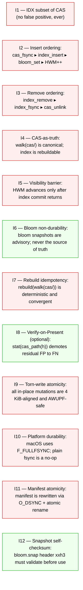
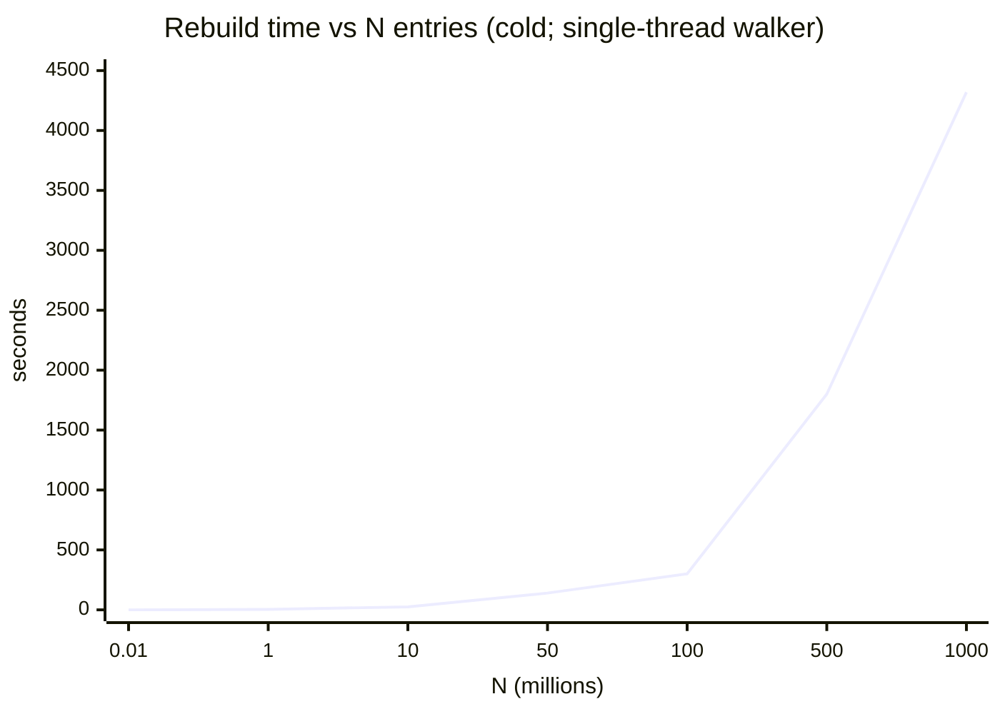
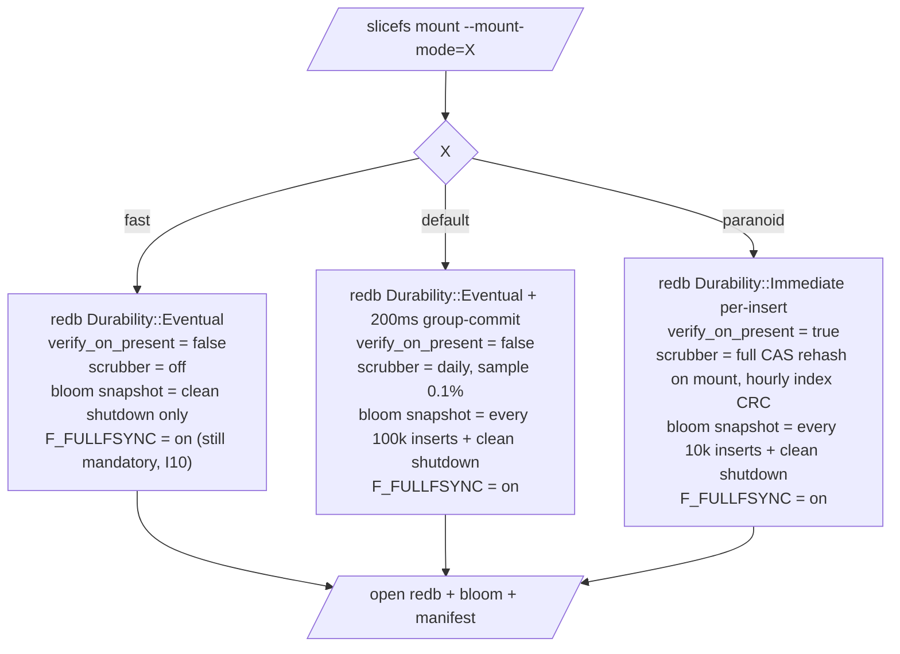
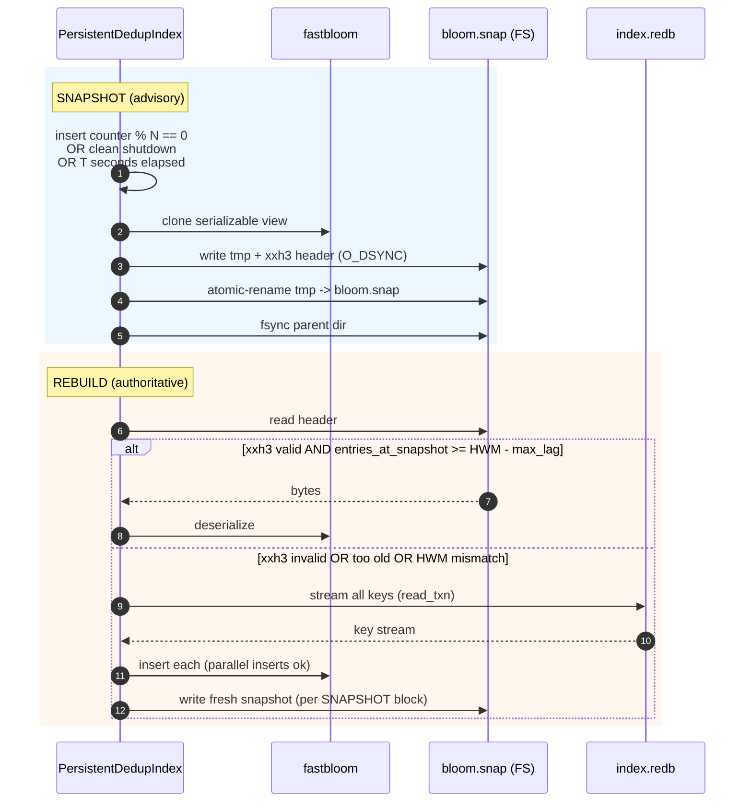
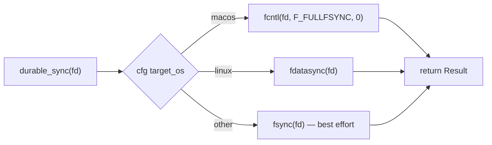

# DedupIndex — Durability & Recovery Architecture

**Status:** ARCHITECTURE — derived from `SYNTHESIS.md` §3, §4, §6.4 and `03-crash-safety.md` §1–§8.
**Date:** 2026-04-23.
**Scope:** Persistent on-disk DedupIndex backing the `slicefs-traits::DedupIndex` trait; redb 4.1 + fastbloom + CAS-as-truth recovery.

Binding contract for the durability properties of `PersistentDedupIndex`. Every implementation choice is justified by one of the invariants in §1. If code weakens an invariant, this document must change first.

---

## 1. Formal Invariants

The catastrophic outcome we forbid is a **false positive** — `lookup(h) → Present` while the CAS block for `h` is not durable. Every other failure mode is recoverable; this one is not.



Hard invariants (red) cannot be relaxed for performance. Soft invariants (green) trade safety against speed; the system remains correct without them, just slower or with elevated FN-on-restart.

| Inv | One-line statement |
|-----|--------------------|
| I1  | At all times, the set of hashes for which `lookup` may return `Present` is a subset of the durable CAS block set. |
| I2  | Insert order is `cas_block.fsync ▸ cas_dir.fsync ▸ redb.commit ▸ bloom.set ▸ HWM++`; no step may reorder ahead. |
| I3  | Remove order is `redb.delete ▸ redb.fsync ▸ cas.unlink`; bloom is never updated on remove. |
| I4  | The CAS directory is the canonical source; the index is a rebuildable cache of it. |
| I5  | The visibility high-water mark advances only after `redb.commit()` returns successfully. |
| I6  | The bloom filter is never authoritative; loss of `bloom.snap` is recoverable from the index. |
| I7  | `rebuild(walk(cas/))` is deterministic and converges to the same `(redb_state, bloom_state)` on retry. |
| I8  | When `verify_on_present=true`, `stat(cas_path(h))` runs before returning `Present`; failure → `Absent`. |
| I9  | All on-disk mutations rely solely on 4 KiB single-sector atomicity (`AWUPF` floor). |
| I10 | On Darwin, every durability point uses `fcntl(F_FULLFSYNC)`; never plain `fsync(2)`. |
| I11 | The `manifest` file is updated via write-temp + `O_DSYNC` + atomic-rename + parent-dir-fsync. |
| I12 | A `bloom.snap` whose xxh3 header does not validate is discarded; rebuild from redb. |

I1, I2, I7, and I10 are the load-bearing four. The others are corollaries or defenses-in-depth.

---

## 2. Insert Sequence

`insert(h)` is called by the chunker only after the CAS block for `h` has been written. The index implementation re-asserts the ordering rather than trusting the caller, because the caller-contract is non-local and breakable.

```mermaid
sequenceDiagram
    autonumber
    participant Caller as Chunker
    participant IDX as PersistentDedupIndex
    participant CAS as LocalDiskStore
    participant FS as OS / kernel
    participant DRV as NVMe device

    Caller->>CAS: put(h, bytes)
    CAS->>FS: write(tmp) ; rename(tmp -> final)
    CAS->>FS: fsync(block_fd)
    alt macOS
        FS->>DRV: fcntl(F_FULLFSYNC) — FLUSH CACHE
    else Linux
        FS->>DRV: fdatasync — FUA / FLUSH
    end
    DRV-->>FS: ack (DRAM -> NAND complete)
    CAS->>FS: fsync(parent_dir_fd)
    FS-->>DRV: dir entry persisted
    Note over CAS,DRV: ▼ DURABILITY BOUNDARY ▼<br/>I1 holds: h ∈ CAS from this point

    Caller->>IDX: insert(&h)
    IDX->>IDX: redb write_txn.open()
    IDX->>IDX: table.insert(h, ())
    IDX->>FS: redb.commit(durability=Eventual)
    Note over IDX,FS: Eventual = COW root staged,<br/>fsync batched within ~200 ms
    FS-->>IDX: ok
    IDX->>IDX: bloom.set(h)  (lock-free atomic)
    IDX->>IDX: HWM.fetch_add(1)
    IDX-->>Caller: Ok(())

    rect rgba(255,240,200,0.4)
    Note over IDX: every N inserts, fork bloom snapshot<br/>(opportunistic; I6)
    end
```

Why the boundary lives where it does: any crash *before* the durability boundary leaves the system in a state where neither CAS nor index references `h` — clean. A crash *after* the boundary but before `redb.commit` returns leaves CAS holding `h` while the index does not — an FN, benign per I4. A crash strictly after `redb.commit` returns gives `Present` answers for a hash whose block is durable — the desired terminal state.

`Durability::Eventual` is acceptable because any insert lost in the 200 ms group-commit window is merely an FN on next mount (the bloom snapshot is also stale, the redb root is a few txns behind, and `walk(cas/)` will resurrect the lost entries during recovery). `Durability::Immediate` is the `paranoid` setting and adds one F_FULLFSYNC per insert.

---

## 3. Lookup Sequence

```mermaid
sequenceDiagram
    autonumber
    participant Caller
    participant IDX as PersistentDedupIndex
    participant Bloom as fastbloom (RAM)
    participant Redb as redb (mmap)
    participant CAS as cas/ dir (FS)

    Caller->>IDX: lookup(&h)
    IDX->>Bloom: contains(h)
    alt Bloom miss
        Bloom-->>IDX: false
        IDX-->>Caller: DefinitelyAbsent (I6 OK; FN never)
    else Bloom hit
        Bloom-->>IDX: true (maybe)
        IDX->>Redb: read_txn.get(h)
        alt redb miss
            Redb-->>IDX: None
            IDX-->>Caller: Absent (bloom FP)
        else redb hit
            Redb-->>IDX: Some(())
            opt verify_on_present (I8)
                IDX->>CAS: stat(cas_path(h))
                alt stat ok
                    CAS-->>IDX: ok
                else stat ENOENT
                    CAS-->>IDX: ENOENT
                    Note over IDX: I1 violation suspected<br/>self-heal: demote to Absent,<br/>schedule background rebuild
                    IDX-->>Caller: Absent
                end
            end
            IDX-->>Caller: Present
        end
    end
```

`verify_on_present` is off by default in `default` mode; it is the residual safety net that converts any I1 violation into a benign FN. The cost is one `stat(2)` per bloom-true-positive lookup (~1–5 µs warm, ~100 µs cold per `03-crash-safety.md` §1). In `paranoid` mode it is on; in `fast` mode it is off and the system relies entirely on I2 ordering.

---

## 4. Crash Scenarios

The state machine of a single insert has six observable points. Each crash point produces a distinct on-disk state and a distinct recovery action.

```mermaid
flowchart TD
    classDef ok fill:#dfd,stroke:#0a0,color:#000
    classDef warn fill:#ffe,stroke:#aa0,color:#000
    classDef bad fill:#fdd,stroke:#c00,color:#000

    Start([insert begins]) --> P1
    P1{P1: crash after CAS write,<br/>before fsync(block)}
    P2{P2: crash after fsync(block),<br/>before fsync(parent_dir)}
    P3{P3: crash after parent fsync,<br/>before redb.commit}
    P4{P4: crash mid-redb.commit<br/>(torn root pointer)}
    P5{P5: crash after commit ack,<br/>before bloom.set}
    P6{P6: crash after bloom.set,<br/>before return Ok}

    Start --> P1
    P1 -->|".tmp file or partial block on disk;<br/>no rename, no idx, no bloom"| R1["State: clean ∅<br/>Action: rm *.tmp on next mount;<br/>caller will retry — idempotent"]
    P2 -->|"block file present but dir entry<br/>may be lost on some FS"| R2["State: maybe-orphan block<br/>Action: dir-walk skips invisible block;<br/>caller retries; CAS put is idempotent"]
    P3 -->|"CAS has h; index does not"| R3["State: FN (benign by I4)<br/>Action: next walk(cas/) will pick it up;<br/>or next insert(h) will re-add to redb"]
    P4 -->|"redb COW: previous root still valid;<br/>page CRCs detect torn page"| R4["State: index rolls back to pre-txn<br/>Action: redb auto-recovery on open;<br/>FN, see R3"]
    P5 -->|"redb has h; bloom + HWM do not"| R5["State: bloom-stale FN<br/>Action: bloom rebuild from redb on mount<br/>(~500 ms / 10M); I6 holds"]
    P6 -->|"all durable; caller never got Ok"| R6["State: durable but unacked<br/>Action: caller retries → idempotent insert;<br/>terminal state is correct"]

    R1:::ok
    R2:::ok
    R3:::warn
    R4:::ok
    R5:::ok
    R6:::ok

    R1 --> Done([safe])
    R2 --> Done
    R3 --> Done
    R4 --> Done
    R5 --> Done
    R6 --> Done
```

The catastrophic state — index says `Present` but CAS does not have the block — is **not reachable from any of P1–P6** because every path that durably commits to the index has, by construction, already durably committed to CAS. This is I1 enforced by I2.

The asymmetric pair to watch is P3+P4: both leave us with an FN. Both are benign. There is no symmetric "FP-producing" crash point.

---

## 5. Recovery Flow

Recovery is mount-time. The startup state machine has five real states and two transient ones.

```mermaid
stateDiagram-v2
    [*] --> Closed
    Closed --> Probing : open(cas/.dedup-index/)
    Probing --> Healthy : redb root CRC ok ∧ bloom.snap xxh3 ok ∧ manifest.last_clean_shutdown=true
    Probing --> Suspect : any of: bloom xxh3 fail / manifest missing or "unclean" / redb open warning / --force-rebuild
    Probing --> Rebuilding : redb root CRC fail ∨ redb file truncated ∨ manifest version mismatch
    Suspect --> Rebuilding : scrubber on Suspect mount detects stale entries beyond threshold
    Suspect --> Healthy : background scrub completes, no anomalies
    Rebuilding --> Healthy : walk(cas/) → bulk-load redb → rebuild bloom → atomic-rename → fsync(parent)
    Healthy --> [*] : umount (writes manifest.last_clean_shutdown=true + bloom.snap)
    Suspect --> [*] : umount (writes manifest with last_clean_shutdown=false; next mount goes Suspect again)
    Rebuilding --> [*] : crash during rebuild — next mount restarts at Probing → Rebuilding (I7 idempotent)
```



**Triggers for `Rebuilding`:**
1. redb refuses to open (corrupt latest root, both shadow roots fail CRC).
2. `manifest` missing, version mismatched, or its `last_clean_shutdown` flag is false **and** the bloom xxh3 fails.
3. Operator passes `--force-rebuild`.
4. On-line scrubber detects > T% of sampled CAS hashes missing from the index (configurable; default 1% in `paranoid`, disabled in `fast`).

**Triggers for `Suspect`:**
1. `manifest.last_clean_shutdown=false` but redb opens cleanly. Mount proceeds RW; background scrub validates a sample.
2. `bloom.snap` xxh3 fails but redb opens cleanly. Mount proceeds RW; bloom rebuilds from redb in the background (~500 ms / 10 M).

**Source of truth:** `walk(cas/)` is canonical (I4). The walker iterates `cas/<XX>/<rest>` per the layout in `disk_block_store.rs` §`hash_to_path`, parses each leaf filename as a hex `ChunkHash`, and emits the resulting key stream.

---

## 6. Rebuild Procedure

Source-of-truth definition (per `crates/cas-local/src/disk_block_store.rs`):

- Root: `<cas_root>`
- Layer 1: 256 shard directories `00`..`ff` (first hex byte of the hash).
- Layer 2: leaf files named `<rest_of_hex>` whose full hash is `<XX> ++ <rest>`.
- Reconstruction rule: `ChunkHash::from_hex(format!("{XX}{rest}"))`.

**Rebuild steps (idempotent per I7):**

1. `mkdir -p cas/.dedup-index/`. `fsync` parent.
2. Open `index.redb.tmp` (fresh redb file) and `bloom.snap.tmp`.
3. Stream-walk `cas/`:
   - For each shard `XX` in `[00..ff]`, `getdents64` the contents.
   - For each entry, validate that `XX ++ rest` parses as `ChunkHash` (28 bytes / 56 hex chars). Skip `*.tmp` files (in-flight CAS writes from §`disk_block_store.rs` line 95).
   - Emit `h` to a bounded MPSC channel.
4. Drainer thread: accumulate up to 100 000 keys; sort; open redb write_txn; `table.insert(h, ())` for each; commit with `Durability::Immediate`.
5. In parallel, push each `h` into the new bloom (lock-free `AtomicBloomFilter`).
6. After last shard: write `bloom.snap.tmp` (header xxh3 + payload), `O_DSYNC`. Atomic-rename `bloom.snap.tmp → bloom.snap`. `fsync` `.dedup-index/`.
7. Atomic-rename `index.redb.tmp → index.redb`. `fsync` `.dedup-index/`.
8. Rewrite `manifest` with `last_clean_shutdown=true`, current bloom_capacity, and the new HWM. `O_DSYNC`. Atomic-rename. `fsync` parent.

**Rebuild cost (per `03-crash-safety.md` §3):**

| N (entries) | Cold (no page cache) | Warm | Notes |
|------------:|---------------------:|-----:|-------|
|        10 K |              ~100 ms | ~50 ms | bloom dominates |
|         1 M |              ~3.5 s | ~600 ms | first redb txn |
|        10 M |              ~25 s  | ~5 s  | mount-time acceptable |
|        50 M |             ~140 s  | ~25 s | edge of mount-time tolerance |
|       100 M |             ~5 min  | ~50 s | requires online rebuild |
|       500 M |            ~30 min  | ~5 min | requires online rebuild + parallel walker |
|         1 B |             ~1.2 h  | ~12 min | per-shard parallel walker; v2 |



**Online vs offline:**
- N ≤ 50 M: rebuild blocks the mount. Acceptable per `SYNTHESIS.md` N5.
- N > 50 M: mount in `Suspect` state with rebuild running in a background thread; `lookup` falls back to `walk(cas/)` for hashes not yet ingested into the partial redb. Writes are gated on rebuild completion to preserve I2 ordering during reconstruction. (v2 lever; offline-only in MVP.)

`umount` while a rebuild is in progress is safe: the `*.tmp` files are discarded and the next mount restarts the rebuild from scratch (I7).

---

## 7. `mount_mode` Knob

User-visible toggle in the SliceFS mount command (and config file). Three modes; default is `default`.



What each mode trades:

| Knob | fast | default | paranoid |
|------|------|---------|----------|
| Per-insert latency floor (consumer NVMe) | ~50 µs | ~100 µs | ~1–4 ms (F_FULLFSYNC) |
| Mount time (10 M entries, healthy) | <1 s | <1 s | ~30 s (sample rehash) |
| Crash window (max FN keys lost) | ~200 ms × insert rate | ~200 ms × insert rate | 0 |
| CPU overhead | <1% | ~1% | ~5% |
| I8 active | no | no | yes |

`fast` is appropriate for seed/migration runs and CI. `default` is the daily driver. `paranoid` is for compliance, archival, and unattended hosts.

---

## 8. Bloom Filter Durability Policy

Per I6, the bloom is never authoritative; a fully empty bloom on mount is recoverable in O(N\_redb) time. The policy is therefore **opportunistic snapshot, authoritative rebuild**.



**Snapshot triggers (any one):**
- Clean shutdown (always).
- Every `bloom_snapshot_every` inserts (default 100 000; 10 000 in `paranoid`).
- Every `bloom_snapshot_interval` seconds (default 600 s; 60 s in `paranoid`).
- On bloom resize / reindex.

**Rebuild from authoritative redb:**
- Startup, when xxh3 fails or header version is wrong (I12).
- Startup, when `entries_at_snapshot` lags HWM by more than `max_lag` (default 1 M).
- Mid-life, when the scrubber detects elevated FPR (>2× nominal).

---

## 9. F_FULLFSYNC on macOS

`fsync(2)` on Darwin returns once data is in the drive's DRAM. Apple SSDs do not flush DRAM → NAND on plain `fsync`. The drive will lose dirty pages on power loss. `F_FULLFSYNC` issues the FLUSH CACHE command and waits for ack — only this is durable. See `03-crash-safety.md` §1, [Tsai 2022], [transactional.blog 2022].



Implementation skeleton:

```rust
#[inline]
pub fn durable_sync(file: &File) -> std::io::Result<()> {
    #[cfg(target_os = "macos")]
    {
        use std::os::unix::io::AsRawFd;
        let rc = unsafe { libc::fcntl(file.as_raw_fd(), libc::F_FULLFSYNC) };
        if rc == -1 { return Err(std::io::Error::last_os_error()); }
        Ok(())
    }
    #[cfg(target_os = "linux")]
    { file.sync_data() }
    #[cfg(not(any(target_os = "macos", target_os = "linux")))]
    { file.sync_all() }
}
```

**Cost (public benchmarks):** Tsai 2022 measured F_FULLFSYNC on a 2021 MBP at ~700 µs–4 ms per call, vs ~30 µs for plain `fsync`. Apple Silicon (M1/M2/M3) is similar in shape but better in absolute terms; we conservatively budget **1–4 ms per F_FULLFSYNC** in `paranoid` mode insert latency. In `default` mode, F_FULLFSYNC runs once per ~200 ms group-commit window, amortized across hundreds of inserts → effectively ~10–40 µs per insert.

This per-platform branch is the only place where the durability semantics diverge by OS. Linux's `fdatasync` already triggers a CACHE FLUSH on most SATA/NVMe configurations and is fast (~100 µs).

---

## 10. Failure Injection Plan

Each invariant should be exercised by at least one fault-injection test. The tests live in `crates/cas-local/tests/dedup_index_crash.rs` and use `kill -9` against a child harness, plus byte-level corruption of the redb/bloom/manifest files.

| # | Scenario | Mechanism | Expected behavior | Validates |
|---|----------|-----------|-------------------|-----------|
| 1 | `kill -9` mid-insert, after CAS fsync, before redb commit | child harness; SIGKILL between `cas.put().fsync()` and `idx.insert()` | next mount: walk(cas/) finds h, redb does not, rebuild path or background scrub adds h; no FP | I2, I4 |
| 2 | `kill -9` during redb commit (torn root) | child harness; SIGKILL inside redb's COW root swap | next mount: redb opens to pre-commit root; FN; rebuild adds back via I7 | I9, I7 |
| 3 | Truncate `index.redb` by 4 KiB at tail | offline byte surgery between mounts | redb refuses to open OR opens to last-clean root; transition Closed→Rebuilding; rebuild succeeds | I9, I7 |
| 4 | Flip a single byte in bloom.snap payload | offline corruption | xxh3 mismatch on header (since header xxh3s the payload); discard snap; rebuild bloom from redb | I12, I6 |
| 5 | Delete `manifest` file | rm between mounts | mount enters Suspect; scrubber validates; manifest rewritten on first clean shutdown | I11 |
| 6 | Delete a CAS block file but keep its index entry | rm `cas/XX/rest` between mounts | with verify_on_present=on (paranoid): next lookup demotes Present→Absent; scrubber detects mismatch; with verify_on_present=off: FP risk masked by I2 only; rebuild closes the gap | I8, I1 |
| 7 | Crash between bloom snapshot rename and parent dir fsync | inject failure after rename(2), before fsync(dir) | next mount: bloom.snap may be invisible; rebuild from redb; correctness preserved | I6, I11 |
| 8 | Inject ENOSPC on redb commit | LD_PRELOAD or fault injection on write(2) | insert returns Err; bloom not updated; HWM not advanced; caller sees error and retries; no FP | I2, I5 |
| 9 | Power-fail simulation (loop device with `nbd-server` + drop) | drop writes after T_drop; reboot loopdev | redb opens to last fsync'd root; FN bounded by T_drop × insert rate; no FP | I9, I10 |
| 10 | Concurrent `kill -9` × 100 with random insert timing | stress harness | aggregated invariant: no run produces a hash h where idx says Present and CAS lacks h | I1 (the headline) |
| 11 | macOS-only: replace `F_FULLFSYNC` with no-op via `DYLD_INSERT_LIBRARIES` shim, then power-fail | simulate the old broken behavior | test must FAIL — proves our F_FULLFSYNC path is load-bearing on Darwin (regression canary) | I10 |
| 12 | Rebuild idempotency: trigger rebuild, kill mid-rebuild, mount again | SIGKILL during walk-and-bulk-load | second rebuild produces byte-identical redb root and bloom payload as a clean rebuild from same CAS state | I7 |

Tests 1, 2, 6, 9, 10, and 11 are mandatory before MVP ship. Tests 3–5, 7–8, 12 are required before `paranoid` mode is declared GA.

---

## Open Questions for the Coordinator

1. **Group-commit window for `Eventual`**: 200 ms is taken from `SYNTHESIS.md` §6.3 but is unmeasured on Apple Silicon. Should we benchmark and tune per `SYNTHESIS.md` §7.3 before locking the default?
2. **Online rebuild for N > 50 M**: deferred to v2 in `SYNTHESIS.md` §8 but the present document assumes a "Suspect" mode that effectively serves partial reads from `walk(cas/)`. Confirm this is acceptable for MVP, or lower the offline-rebuild threshold.
3. **`verify_on_present` default in `default` mode**: `SYNTHESIS.md` §6.1 says `false`; the cost-vs-safety tradeoff (1–5 µs warm `stat`) may be cheap enough to flip on by default. Decision needed.
