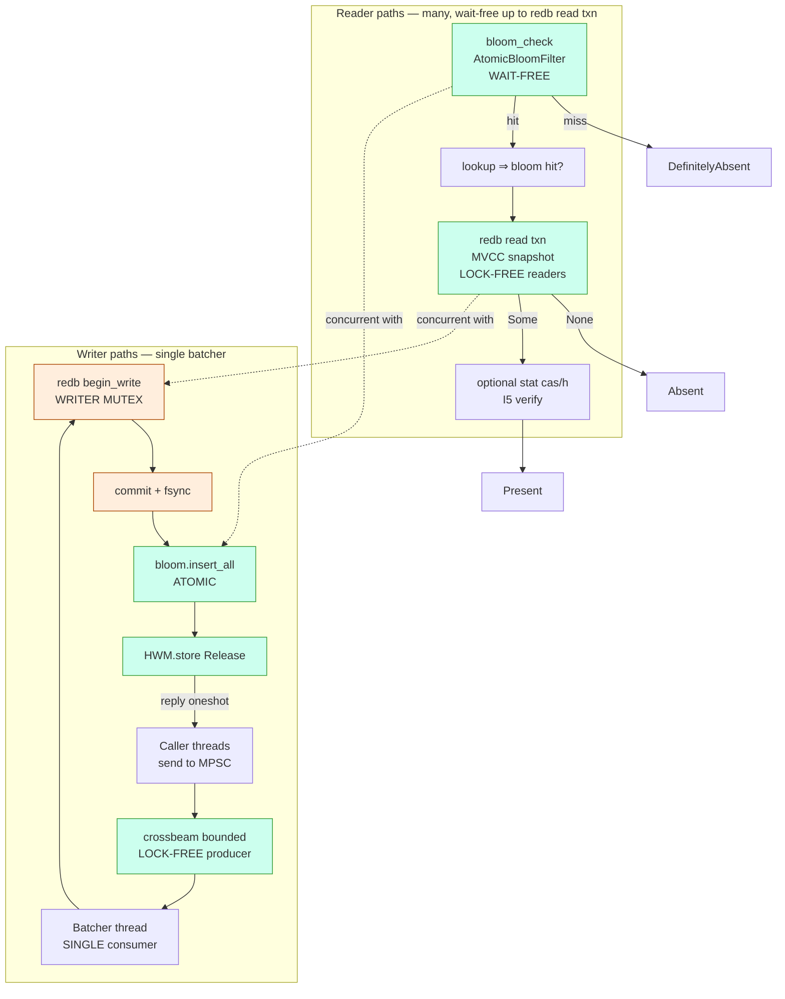
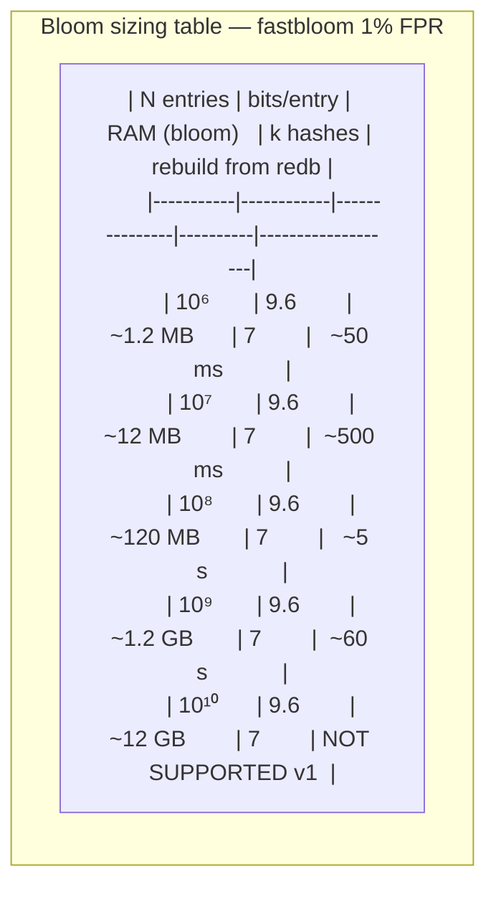
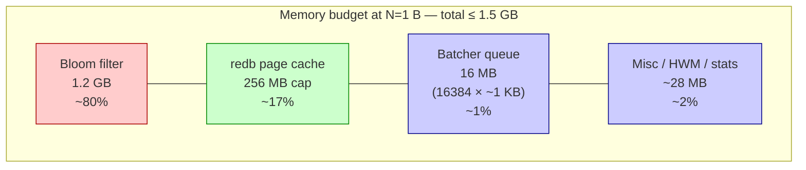
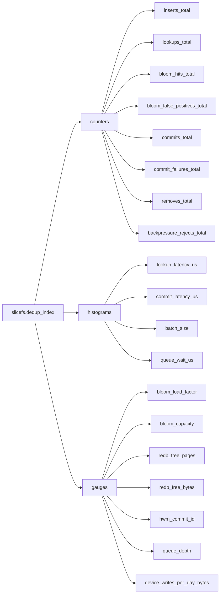
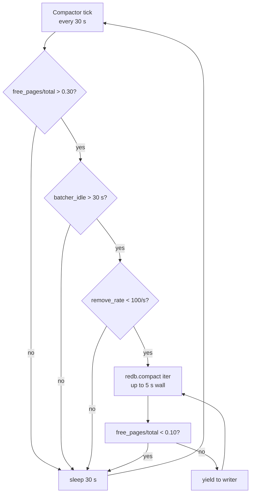
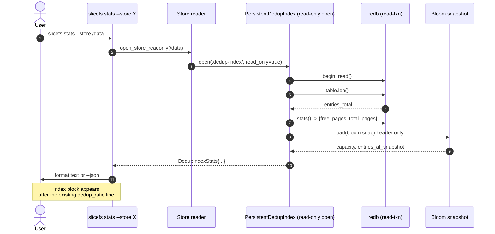

# DedupIndex — Performance & Operations Architecture

**Status:** DESIGN. Operational layer for the redb-backed `PersistentDedupIndex`.
**Date:** 2026-04-23.
**Inputs:** `SYNTHESIS.md`, `02-ssd-friendliness.md`, `03-crash-safety.md`, `slicefs-traits/src/dedup_index.rs`.

This document fixes the runtime contract — SLOs, batching writer thread, concurrency, memory, observability, GC interaction, compaction, `stats` integration, and benchmarks — for the v1 implementation chosen in `SYNTHESIS.md` (redb 4.1 + `Durability::Eventual` + fastbloom front + CAS-as-truth recovery).

---

## 1. SLO proposal

SLOs are anchored in three workload phases and the device envelope from `02-ssd-friendliness.md` (consumer NVMe, AWUPF=4 KiB, F_FULLFSYNC 1–4 ms on Darwin). All targets assume single-host commodity NVMe; values that depend on the warm page cache are flagged "warm".

| SLO | Target | Justification |
|---|---|---|
| **Cold lookup p50** | ≤ 80 µs | One redb leaf read; cold NVMe random-4 K ≈ 50–80 µs (`02-ssd-friendliness.md §1`). |
| **Cold lookup p99** | ≤ 500 µs | Two redb pages (root miss + leaf), one OS readahead stall, one CRC32C verify. Aligns with `SYNTHESIS.md §N3`. |
| **Warm lookup p50** | ≤ 5 µs | Bloom-only path — single fastbloom probe (~50 ns) + branch. `03-crash-safety.md §3` cites 50 ns/probe. |
| **Warm lookup p99** | ≤ 10 µs | Bloom hit + redb read in page cache. `SYNTHESIS.md §N3`. |
| **Insert throughput, seed mode** | ≥ 100 K ins/s sustained | Open question 4 in `SYNTHESIS.md`. Group-commit at 64 KiB–1 MiB segments, `02-ssd-friendliness.md §3`. Below this, escalate to log-structured. |
| **Insert throughput, steady-state** | ≥ 20 K ins/s sustained | Bloom front absorbs >99% of duplicates (`04-prior-art §9`); steady inserts are novel-only. 20 K matches `commit_delay≈200 µs` group-commit math. |
| **Commit latency p99 (default mode)** | ≤ 5 ms | One redb commit = page-COW + 4 KiB superblock atomic + F_FULLFSYNC (1–4 ms `03-crash-safety.md §1`). |
| **Commit latency p99 (paranoid)** | ≤ 12 ms | Adds per-insert F_FULLFSYNC; bound by drive cache flush. Acceptable — paranoid is opt-in. |
| **Recovery RTO (≤ 50 M chunks)** | ≤ 30 s | `walk(cas/) ≈ 1 M entries/s` warm, bulk-load redb at 100 K keys/txn (`03-crash-safety.md §3`). |
| **Recovery RTO (1 B chunks)** | ≤ 30 min offline / online for >50 M | `SYNTHESIS.md §N5` allows online above the threshold. |
| **Memory ceiling, total** | ≤ 1.5 GB at N=1 B | Bloom (1.2 GB @ 1% FPR) + redb cache (256 MB cap) + batcher (16 MB cap). `SYNTHESIS.md §N2`. |

These are SLOs not contracts — they are observable ceilings. Violation triggers v2 escalation per `SYNTHESIS.md §8`.

---

## 2. Batching writer thread

redb is single-writer per database; per-insert commits cap throughput at ~the F_FULLFSYNC rate (200–1000 commits/s on consumer NVMe). The batcher coalesces N caller threads' inserts into one redb txn.

**Design:**
- **Queue:** `crossbeam_channel::bounded(N=16384)` MPSC (production-tested, fairer than `std::sync::mpsc` under contention; lock-free producer side).
- **Reply channel:** per-request `tokio::sync::oneshot` (or `crossbeam_channel::bounded(1)` for sync callers). Caller blocks until reply — required by `I2` ordering (visibility = post-commit).
- **Batch size:** up to 10 000 inserts per txn (matches `SYNTHESIS.md §6.6`); seed mode raises to 100 000.
- **Batch timeout (coalescing window):** **2 ms** in default mode, **20 ms** in seed mode. 2 ms keeps p99 caller-visible insert latency under the 5 ms commit budget while still amortizing the F_FULLFSYNC over hundreds of inserts at typical insert rates.
- **Backpressure:** queue full ⇒ producer blocks (bounded channel = natural backpressure). A `try_send` fast path returns `CasError::Backpressure` for non-critical callers (e.g. opportunistic warmup); the chunker on the hot path uses blocking send.
- **Bloom + HWM update:** done by the batcher *after* the redb commit succeeds, so a crash mid-batch leaves bloom & HWM consistent with the durable state (only inserts that survived the commit are visible).

```mermaid
sequenceDiagram
    autonumber
    participant C1 as Caller-1..10k
    participant Q as MPSC queue<br/>bounded(16384)
    participant B as Batcher thread
    participant DB as redb writer txn
    participant Bf as Bloom + HWM

    C1->>Q: send(InsertReq{hash, reply_tx})
    Note over Q,B: Batcher loops:<br/>recv_timeout(2 ms)<br/>OR len ≥ 10 000

    B->>Q: drain up to 10 000 reqs
    B->>DB: begin_write()
    loop For each req
        B->>DB: table.insert(hash, ())
    end
    B->>DB: commit()  [Eventual durability; group fsync]
    DB-->>B: Ok(commit_id)
    B->>Bf: bloom.insert_all(hashes)
    B->>Bf: HWM.store(commit_id)

    par fanout reply
        B-->>C1: reply_tx.send(Ok)
    end
    Note over C1: Caller wakes; insert is now durable<br/>and bloom-visible (I2 satisfied)
```

The batcher is a single OS thread; CPU bound only at >500 K req/s, where redb commit cost dominates anyway.

---

## 3. Concurrency map



**Lock map:** the only mutex is redb's internal write-txn lock, held by the batcher only. Readers use redb's MVCC snapshot reads (no lock vs writer). Bloom and HWM are atomic. Producers contend only on the bounded MPSC tail (lock-free in crossbeam).

---

## 4. Bloom sizing strategy

Static sizing, capacity = `max(current_count × 4, 1 M)`. fastbloom default seeds 7 hashes for 1% FPR.



- **Target FPR:** 1% (default). FP costs an extra redb read; at warm-cache 5 µs cost, FP@1% is 50 ns amortized — invisible.
- **Fastbloom benchmarks:** ~50 ns / probe, ~200 MB/s insert; rebuild from redb stream is ~17 M keys/s warm (`03-crash-safety.md §7`).
- **Static vs dynamic:** **static at mount.** No online resize (`SYNTHESIS.md §6.5`). At >90% load factor, emit warning + recommend offline `slicefs reindex --bloom-capacity 2x`. v2.1 adds segment-blooms (additive growth without rebuild).
- **N=10¹⁰ excluded:** 12 GB RAM ceiling violation; deferred to v2 segment-bloom design.
- **At N=1 B:** the 1.2 GB is the hard cost of single-host dedup at this scale. `SYNTHESIS.md §N2` accepts this; the alternative is the ZFS DDT antipattern (`04-prior-art §1`).

---

## 5. Memory budget

Caps below are enforced as configuration defaults; operators can raise them but the bloom is the only one that scales with N.



| Component | Cap | Scales with | Notes |
|---|---|---|---|
| Bloom filter | 1.2 GB at N=1 B | O(N) | hard cost; static at mount |
| redb page cache | 256 MB | O(1) | redb 4.1 default; bounded LRU |
| Batcher MPSC queue | 16 MB (16 384 entries) | O(1) | bounded; backpressure when full |
| HWM, stats counters | < 1 MB | O(1) | atomics + tracing histograms |
| Recovery scratch | up to 1 GB transient | O(N) | only during rebuild; freed on completion |

**Hard rule:** the steady-state RSS of `PersistentDedupIndex` shall not exceed `bloom + 300 MB`. Recovery transient is exempt and reported separately.

---

## 6. Observability

**Stack:** `tracing` for spans + structured logs; `metrics` crate (Prometheus exporter optional, behind a feature flag). Counters and gauges are zero-dep in default build; histogram emission via `metrics` if `prometheus` feature enabled.

**Metric tree:**



- **FN counter:** `bloom_check==false ∧ on-disk has it` is structurally impossible (`I1`); we expose a debug-build assertion counter instead (`bloom_invariant_violations_total`).
- **Sampling:** histograms use `metrics`'s exponential buckets [10 µs, 30 ms].
- **`device_writes_per_day_bytes`** is the v2-escalation trigger from `SYNTHESIS.md §5 (5)`: above 5% DWPD/day on the index alone, swap to log-structured.

---

## 7. GC interaction

`remove()` does NOT touch the bloom (per trait docs and `I3`). Over a GC cycle the bloom drifts above its design FPR — a benign state, but eventually expensive (every drifted entry costs an extra redb read).

**Rebuild trigger:** `effective_fpr > 4 × design_fpr` OR `drift_ratio = removed_since_rebuild / capacity > 0.20`. Either condition schedules a background bloom rebuild from the live redb table — same code path as recovery, runs without taking the mount offline.

**Cost of rebuild:** `~17 M keys/s` from redb (`03-crash-safety.md §7`). At N=1 B that's ~60 s of background CPU + reading ~5 GB of redb (page-cache friendly, sequential). Triggered out of GC's epilogue; serialized via a `tokio::sync::Notify`.

```mermaid
sequenceDiagram
    autonumber
    participant GC as GC engine
    participant Idx as PersistentDedupIndex
    participant Bf as Bloom (live)
    participant DB as redb
    participant Bn as Bloom (new)

    GC->>Idx: remove(h₁..h_n)  [10% of entries]
    loop for each h
        Idx->>DB: txn.remove(h)
    end
    Idx->>DB: commit
    Note over Bf: bloom NOT updated<br/>(I3, drift accumulates)

    Idx->>Idx: drift_ratio = 0.10 + ... ≥ 0.20?
    alt drift threshold reached
        Idx->>Bn: spawn background rebuild
        Bn->>DB: range_scan(table)
        loop for each remaining hash
            Bn->>Bn: bloom_new.insert(h)
        end
        Bn->>Bf: atomic swap (Arc::store)
        Bn->>Idx: snapshot bloom_new to bloom.snap.tmp
        Bn->>Idx: rename → bloom.snap; fsync dir
    else below threshold
        Note over Idx: defer; emit gauge bloom_drift_ratio
    end
```

---

## 8. Compaction

redb is COW; deleted entries leave free pages. Three options were considered:

| Strategy | Latency cost | Space recovery | Complexity | Verdict |
|---|---|---|---|---|
| Opportunistic (per-commit) | adds 2–5 ms to every commit | continuous | low | rejected — kills commit p99 |
| Scheduled (every N commits) | 50–500 ms spike every ~10 min | bursty | low | rejected — visible latency cliff |
| **Online (background thread)** | invisible to callers | continuous, slow | medium | **picked** |

**Pick: online background compactor.** redb 4.1 exposes `Database::compact()` and free-page metrics. We run a low-priority compactor thread that wakes when `free_pages / total_pages > 0.30` AND `idle_writer_for > 30 s`, runs `compact()` until `free_pages / total < 0.10`, sleeps.



**Why online beats scheduled:** the batcher already serializes writes; the compactor uses redb's own background-friendly API and yields between iterations. We pay slightly higher steady-state CPU for predictable p99.

---

## 9. `stats` subcommand integration

`crates/slicefs-cli/src/stats.rs::run_stats` already prints store-wide dedup ratio. We extend it with an `[Index]` block sourced from `PersistentDedupIndex::stats()` (a new method returning a `DedupIndexStats` struct).

**New fields surfaced:**
- `entries_total` (redb table row count)
- `bloom_capacity`, `bloom_entries`, `bloom_load_factor`, `bloom_effective_fpr`
- `commits_total`, `device_writes_bytes`, `device_writes_per_day_bytes`
- `redb_free_pages`, `redb_total_pages`, `compaction_pending` (boolean)
- `last_clean_shutdown` (from manifest)
- `mode` (`seed` / `default` / `paranoid`)



JSON output is additive (new top-level key `"dedup_index": {...}`) so existing scripts keep working.

---

## 10. Benchmark plan

Live under `benchmarks/dedup_index/` (criterion-based; reuses existing `benchmarks/` infra). Six benches, each gated by feature flag where it costs disk space.

| # | Bench | Goal | SLO it validates |
|---|---|---|---|
| 1 | `bench_seed_burst_100m` | Seed 100 M hashes in `seed` mode; measure ins/s | §1 row "seed throughput ≥ 100 K/s" — the gate from `SYNTHESIS.md §7 Open Q4` |
| 2 | `bench_lookup_warm` | 10 M warm lookups, 50/50 hit/miss | §1 warm p50/p99 |
| 3 | `bench_lookup_cold` | drop_caches, 100 K cold lookups | §1 cold p50/p99 |
| 4 | `bench_steady_mixed` | 80% lookup / 20% insert at N=10 M | §1 steady insert ≥ 20 K/s, no commit spikes |
| 5 | `bench_commit_latency` | 10 K isolated commits, F_FULLFSYNC on/off | §1 commit p99 ≤ 5 ms |
| 6 | `bench_recovery_50m` | rebuild 50 M-entry index from CAS | §1 RTO ≤ 30 s |
| 7 | `bench_gc_drift_rebuild` | remove 20% then rebuild bloom; measure freeze | §7 drift-rebuild cost |

Bench 1 doubles as the v2-escalation gate: a CI run on the reference NVMe must clear 100 K ins/s or the issue auto-routes to the log-structured v2 design queue.

---

## 11. Cross-references

- `I1`–`I5` invariants: `SYNTHESIS.md §3` and `03-crash-safety.md §Formal-Spec`.
- WAF + endurance numbers: `02-ssd-friendliness.md §1, §8`.
- F_FULLFSYNC mandatory on Darwin: `03-crash-safety.md §1`.
- v2 escalation triggers: `SYNTHESIS.md §5 (5), §8`.
